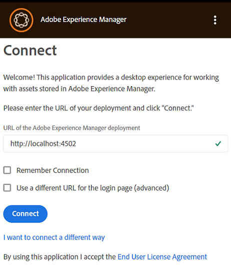
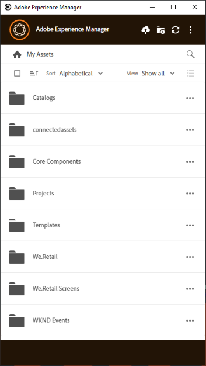

# 설치 [!DNL Adobe Experience Manager] 데스크탑 앱 {#install-app-v2}

사용 [!DNL Adobe Experience Manager] 데스크탑 앱, 내의 자산 [!DNL Experience Manager] 로컬 데스크탑에서 쉽게 사용할 수 있으며 모든 기본 데스크탑 애플리케이션에서 사용할 수 있습니다. 에셋을 미리 보고, 기본 데스크탑 애플리케이션에서 열고, Mac Finder 또는 Windows 탐색기에 표시하여 다른 문서에 배치할 수 있고, 로컬로 변경할 수 있습니다. 변경 사항은 다시 로 저장됩니다. [!DNL Experience Manager] 를 업로드하고 저장소에 새 버전이 만들어지는 경우.

이러한 통합을 통해 조직의 다양한 역할이 다음을 수행할 수 있습니다.

* 의 중앙 집중식 자산 관리 [!DNL Experience Manager Assets].

* 서드파티 애플리케이션 및 Adobe Creative Cloud을 비롯한 모든 기본 데스크탑 애플리케이션의 자산에 액세스합니다. 그러면서도 사용자는 브랜딩을 포함한 다양한 표준을 쉽게 준수할 수 있다.

사용 [!DNL Experience Manager] 데스크탑 앱:

* 다음을 확인합니다. [!DNL Experience Manager] 버전은 다음에 의해 지원됩니다. [!DNL Experience Manager] 데스크탑 앱입니다. 다음을 참조하십시오. [시스템 요구 사항](release-notes.md).

* 애플리케이션을 다운로드하여 설치합니다. 다음을 참조하십시오 [데스크탑 앱 설치](#install-v2) 아래요.

* 몇 가지 자산을 사용하여 연결을 테스트합니다. 다음을 참조하십시오 [에셋 검색 및 탐색 방법](using.md#browse-search-preview-assets).

## 시스템 요구 사항, 사전 요구 사항 및 다운로드 링크 {#tech-specs-v2}

자세한 내용은 [[!DNL Experience Manager] 데스크탑 앱 릴리스 노트](release-notes.md).

## 이전 버전에서 업그레이드 {#upgrade-from-previous-version}

데스크탑 앱 v1.x의 사용자인 경우 이전 버전의 앱과 최신 버전의 차이점과 유사성을 이해합니다. 다음을 참조하십시오 [데스크탑 앱의 새로운 기능](introduction.md#whats-new-v2) 및 [앱 작동 방식](release-notes.md#how-app-works).

>[!NOTE]
>
>컴퓨터에 두 버전의 데스크톱 앱을 함께 사용할 수 없습니다. 버전을 설치하기 전에 다른 버전을 제거합니다.

이전 버전의 앱에서 업그레이드하려면 다음 지침을 따르십시오.

1. 업그레이드하기 전에 모든 에셋을 동기화하고 변경 사항을 업로드하십시오. [!DNL Experience Manager]. 따라서 앱을 제거할 때 편집 내용이 손실되지 않습니다.

1. 이전 버전의 앱을 제거합니다. 제거할 때 옵션을 선택하여 캐시를 지웁니다.

1. 컴퓨터를 다시 시작합니다.

1. [다운로드](release-notes.md) 및 [설치](#install-v2) 최신 앱. 아래 지침을 따르십시오.

## 설치 {#install-v2}

데스크탑 앱을 설치하려면 다음 단계를 따르십시오. 기존 Adobe 제거 [!DNL Experience Manager] 최신 앱을 설치하기 전에 데스크탑 앱 v1.x를 사용하십시오. 자세한 정보는 위를 참조하십시오.

1. 에서 최신 설치 관리자 다운로드 [릴리스 정보](release-notes.md) 페이지를 가리키도록 업데이트하는 중입니다.

1. 의 URL 및 자격 증명 보관 [!DNL Experience Manager] 편리한 배포.

1. 다른 버전의 앱에서 업그레이드하는 경우 다음을 참조하십시오. [데스크탑 앱 업그레이드](#upgrade-from-previous-version).

1. 을 사용하는 경우 이 단계를 건너뜁니다. [!DNL Experience Manager] as a [!DNL Cloud Service], [!DNL Experience Manager] 6.4.4 이상 또는 [!DNL Experience Manager] 6.5.0 이상 다음을 확인합니다. [!DNL Experience Manager] 설치 프로그램은 다음 문서에 언급된 호환성 요구 사항을 충족합니다. [릴리스 정보](release-notes.md). 필요한 경우 해당 다운로드 [호환성 패키지](https://experience.adobe.com/#/downloads/content/software-distribution/en/aem.html?package=/content/software-distribution/en/details.html/content/dam/aem/public/adobe/packages/cq640/featurepack/adobe-asset-link-support) 및 를 사용하여 설치 [!DNL Experience Manager] 패키지 관리자 as a [!DNL Experience Manager] 관리자. 패키지를 설치하려면 다음을 참조하십시오 [패키지를 사용하여 작업하는 방법](https://experienceleague.adobe.com/docs/experience-manager-65/administering/contentmanagement/package-manager.html).

1. 설치 관리자 바이너리를 실행하고 화면의 지침에 따라 설치합니다.

1. Windows에서 설치 프로그램이 설치 여부를 묻는 메시지를 표시할 수 있습니다. `Visual Studio C++ Redistributable 2015`. 화면의 지침에 따라 설치합니다. 설치에 실패한 경우 수동으로 설치합니다. 에서 설치 관리자 다운로드 [여기](https://www.microsoft.com/en-us/download/details.aspx?id=52685) 및 설치 `vc_redist.x64.exe` 및 `vc_redist.x86.exe` 파일. 재실행 [!DNL Experience Manager] 데스크탑 앱 설치 관리자.

1. 메시지가 표시되면 시스템을 다시 시작합니다. 데스크탑 앱을 실행하고 구성합니다.

1. 앱을 와 연결하려면 [!DNL Experience Manager] 리포지토리에서 앱 아이콘을 클릭하고 앱을 실행합니다. 의 주소를 입력합니다. [!DNL Experience Manager] 형식의 서버 `https://[aem_server]:[port]/`.

   클릭 **[!UICONTROL Connect]** 자격 증명을 제공합니다.

   

   *그림: 서버 주소 입력을 위한 연결 화면*

   선택 **[!UICONTROL Remember Connection]** 데스크탑 앱에 로그인할 때마다 연결 세부 정보를 입력하지 않도록 합니다.

   >[!CAUTION]
   >
   >주소 앞이나 뒤에 선행 또는 후행 공백이 없는지 확인합니다. [!DNL Experience Manager] 서버입니다. 그렇지 않으면 앱에서 [!DNL Experience Manager] 서버입니다.

1. 연결에 성공하면 의 루트 폴더에서 사용할 수 있는 폴더 및 에셋 목록을 볼 수 있습니다. [!DNL Experience Manager] DAM. 앱 내에서 폴더를 검색할 수 있습니다.

   

   *그림: 로그인 후 애플리케이션에 DAM 콘텐츠가 표시됨*

1. ([!DNL Experience Manager] 6.5.1 이상) 데스크탑 앱을 [!DNL Experience Manager] 6.5.1 이상 버전, S3 또는 Azure 커넥터를 버전 1.10.4 이상으로 업그레이드하십시오. 다음을 참조하십시오 [Azure 커넥터](https://experienceleague.adobe.com/docs/experience-manager-65/deploying/deploying/data-store-config.html#azure-data-store) 또는 [S3 커넥터](https://experienceleague.adobe.com/docs/experience-manager-65/deploying/deploying/data-store-config.html#amazon-s-data-store).

   Adobe Managed Services(AMS) 고객인 경우 Adobe 고객 지원 센터에 문의하십시오.

## 환경 설정 지정 {#set-preferences}

기본 설정을 변경하려면  및 **[!UICONTROL Preference]** . 다음에서 **[!UICONTROL Preferences]** 창에서 다음 값을 조정합니다.

* [!UICONTROL Launch application on login].

* [!UICONTROL Show window when application starts].

* **[!UICONTROL Cache Directory]**: 앱의 로컬 캐시 위치(로컬로 다운로드한 에셋이 포함되어 있음)

* **[!UICONTROL Network Drive Letter]**: 를 매핑하는 데 사용되는 드라이브 문자 [!DNL Experience Manager] DAM. 확실하지 않은 경우 변경하지 마십시오. 앱은 Windows의 모든 드라이브 문자에 매핑할 수 있습니다. 두 사용자가 서로 다른 드라이브 문자의 자산을 배치하면 서로 다른 사용자가 배치한 자산을 볼 수 없습니다. 에셋의 경로가 변경됩니다. 에셋은 바이너리 파일(예: INDD)에 계속 배치되며 제거되지 않습니다. 앱은 사용 가능한 모든 드라이브 문자를 나열하며 기본적으로 일반적으로 사용 가능한 마지막 문자를 사용합니다. `Z`.

* **[!UICONTROL Maximum Cache Size]**: 로컬로 다운로드한 자산을 저장하는 데 사용되는 하드 디스크의 허용 캐시(GB)입니다.

* **[!UICONTROL Current cache size]**: 로컬로 다운로드한 에셋의 저장소 크기입니다. 앱을 사용하여 에셋을 다운로드한 후에만 정보가 표시됩니다.

* **[!UICONTROL Automatically download linked assets]**: 원본 파일을 다운로드하면 지원되는 기본 Creative Cloud 앱에 배치된 자산을 자동으로 가져옵니다.

* **[!UICONTROL Maximum number of downloads]**:  주의하여 변화하라. 처음 에셋을 다운로드할 때(표시, 열기, 편집, 다운로드 또는 이와 유사한 옵션을 통해) 에셋은 배치에 이 숫자 미만이 포함된 경우에만 다운로드됩니다. 기본값은 50입니다. 확실하지 않은 경우 변경하지 마십시오. 값을 늘리면 대기 시간이 길어질 수 있으며 값을 줄이면 필요한 에셋 또는 폴더를 한 번에 다운로드할 수 없습니다.

* **[!UICONTROL Use legacy conventions when creating nodes for assets and folders]**:  주의하여 변화하라. 이 설정을 사용하면 폴더를 업로드할 때 앱이 v1.10 앱 동작을 에뮬레이션할 수 있습니다. v1.10에서 리포지토리에서 만든 노드 이름은 사용자가 제공한 폴더 이름의 공백과 대/소문자를 따릅니다. 그러나 앱 v2.1에서는 폴더 이름의 추가 공백이 대시로 변환됩니다. (예: 업로드) `New Folder` 또는 `new   folder` 옵션을 선택하지 않고 v2.1의 기본 비헤이비어가 유지되는 경우 저장소에서 동일한 노드를 만듭니다. 이 옵션을 선택하면 위의 두 폴더에 대해 저장소에 다른 노드가 만들어지고 v1.10 앱의 동작과 일치합니다.

  v2.1의 기본 동작은 계속 동일하게 유지됩니다. 즉, 폴더 이름의 여러 공백을 저장소 노드 이름의 대시로 바꾸고 소문자 노드 이름으로 변환합니다.

* **[!UICONTROL Upload Acceleration]**:  주의하여 변화하라. 에셋을 업로드할 때 애플리케이션에서 동시 업로드를 사용하여 업로드 속도를 향상시킬 수 있습니다. 슬라이더를 오른쪽으로 이동하여 업로드의 동시성을 높일 수 있습니다. 맨 왼쪽에 있는 슬라이더는 동시성(단일 스레드 업로드)이 없음을 의미하며, 중간 위치는 10개의 동시 스레드에 해당하며, 맨 오른쪽에 있는 최대 제한은 20개의 동시 스레드에 해당합니다. 동시성 제한이 높을수록 리소스가 많이 사용됩니다.

사용할 수 없는 기본 설정을 업데이트하려면 [!DNL Experience Manager] 서버 및 업데이트를 차례로 수행합니다. 기본 설정을 업데이트한 후 .


*그림: 데스크탑 앱 환경 설정.*

### 프록시 지원 {#proxy-support}

[!DNL Experience Manager] 데스크탑 앱은 시스템의 사전 정의된 프록시를 사용하여 HTTPS를 통해 인터넷에 연결합니다. 앱은 추가 인증이 필요하지 않은 네트워크 프록시만 사용하여 연결할 수 있습니다.

Windows용 프록시 서버 설정(인터넷 옵션 > LAN 설정)을 구성하거나 수정하려면 [!DNL Experience Manager] 데스크탑 앱으로 변경 사항을 적용합니다. 프록시 구성은 데스크탑 앱을 시작할 때 적용됩니다. 변경 사항을 적용하려면 앱을 닫았다가 다시 실행하십시오.

프록시에 인증이 필요한 경우 IT 팀은 [!DNL Experience Manager Assets] 응용 프로그램 트래픽이 통과할 수 있도록 허용하는 프록시 서버 설정의 URL입니다.

## 앱 제거 {#uninstall-the-app}

Windows에서 응용 프로그램을 제거하려면 다음 단계를 수행하십시오.

1. 모든 변경 사항을 업로드 [!DNL Experience Manager] 편집을 손실하지 않도록 합니다. 다음을 참조하십시오 [에셋 편집 및 업데이트된 에셋 업로드 [!DNL Experience Manager]](using.md#edit-assets-upload-updated-assets). 로그오프 및 [!UICONTROL Exit] 앱.

1. 다른 OS 응용 프로그램을 제거하는 것처럼 앱을 제거합니다. Windows의 프로그램 추가 및 제거에서 제거 합니다.

1. 캐시와 로그를 제거하려면 필요한 확인란을 선택합니다.

   

1. 화면의 지시를 따릅니다. 완료되면 시스템을 다시 시작합니다.

Mac에서 애플리케이션을 제거하려면 다음 단계를 따르십시오.

1. 모든 변경 사항을 업로드 [!DNL Experience Manager] 편집을 손실하지 않도록 합니다. 다음을 참조하십시오 [에셋 편집 및 업데이트된 에셋 업로드 [!DNL Experience Manager]](using.md#edit-assets-upload-updated-assets). 로그오프 및 [!UICONTROL Exit] 앱.

1. 제거 `Adobe Experience Manager Desktop.app` 출처: `/Applications`.

또는 Mac에서 내부 애플리케이션 캐시를 지우고 앱을 제거하려면 터미널에서 다음 명령을 실행할 수 있습니다.

```shell
/Applications/Adobe Experience Manager Desktop/Contents/Resources/uninstall-osx/uninstall.sh
```
