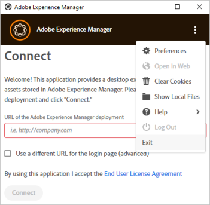

# 문제 해결 [!DNL Adobe Experience Manager] 데스크탑 앱 {#troubleshoot-v2}

[!DNL Adobe Experience Manager] 데스크탑 앱이에 연결 [!DNL Experience Manager] 배포의 DAM(디지털 자산 관리) 리포지토리입니다. 이 앱은 컴퓨터에서 저장소 정보 및 검색 결과를 가져오고, 파일 및 폴더를 다운로드 및 업로드하며, Assets 사용자 인터페이스와의 충돌을 관리하는 기능을 포함합니다.

앱 문제를 해결하려면 을 읽고, 모범 사례를 배우고, 제한 사항을 확인합니다.

## 우수 사례 {#best-practices-to-prevent-troubles}

몇 가지 일반적인 문제 및 문제 해결을 방지하려면 다음 모범 사례를 따르십시오.

* **데스크탑 앱 작동 방식 이해**: 애플리케이션 사용을 시작하기 전에 앱의 작동 방식을 알고 있는 동안 잠시 기다려 주십시오. 다음 간 연결에 대해 알아보기 [!DNL Experience Manager] 웹 인터페이스 및 데스크탑, 저장소 매핑, 에셋 캐싱, 로컬 저장 및 백그라운드 업로드 다음을 참조하십시오 [작동 방식](release-notes.md#how-app-works).

* **폴더 이름에 지원되지 않는 문자를 사용하지 마십시오.**: 폴더를 만들거나 업로드할 때 공백과 잘못된 문자를 사용하지 마십시오. 문자 목록 보기: [폴더 만들기 [!DNL Experience Manager Assets]](https://experienceleague.adobe.com/docs/experience-manager-65/assets/managing/manage-assets.html#creating-folders). 일부 [!DNL Experience Manager] 사용 사례는 폴더 이름에 지원되지 않는 문자가 있을 수 있습니다.

* **충돌을 피하는 모범 사례**: 여러 에셋에 대해 공동 작업을 수행할 때 발생할 수 있는 충돌을 방지하려면 다음을 참조하십시오. [편집 충돌 방지](using.md#adv-workflow-collaborate-avoid-conflicts).

* **대규모 계층형 폴더에 폴더 업로드 사용**: Assets 웹 인터페이스나 기타 방법을 사용하는 대신 [!DNL Experience Manager] 큰 폴더를 업로드할 데스크톱 앱입니다. 앱이 로깅 및 모니터링과 함께 백그라운드의 자산을 업로드합니다. 다음을 참조하십시오 [자산 일괄 업로드](using.md#bulk-upload-assets).

* **최신 버전 사용**: 새 앱 버전을 설치하거나 최신 앱 버전으로 업그레이드하기 전에 최신 앱 버전을 사용하고 항상 호환성을 확인하십시오 [!DNL Experience Manager] 버전. 다음을 참조하십시오 [릴리스 정보](release-notes.md).

* **동일한 드라이브 문자 사용**: 조직 전체에서 동일한 드라이브 문자를 사용하여 [!DNL Experience Manager] DAM. 다른 사용자가 배치한 에셋을 보려면 경로가 동일해야 합니다. 동일한 드라이브 문자를 사용하면 DAM 에셋에 대한 경로가 일정하게 유지됩니다. 에셋은 배치된 상태로 유지되며 다른 사용자가 다른 드라이브 문자를 사용하더라도 제거되지 않습니다.

* **네트워크 관리**: 네트워크 성능은 다음과 같이 중요합니다. [!DNL Experience Manager] 데스크탑 앱의 성능입니다. 파일 전송 또는 대량 작업에 대한 응답이 느려진 경우 많은 네트워크 트래픽을 일으킬 수 있는 기능이나 앱을 끕니다.

* **데스크탑 앱에 대해 지원되지 않는 사용 사례**: 에셋의 마이그레이션(계획 및 기타 도구가 필요함), 작업이 많은 DAM 작업(예: 큰 폴더 이동, 큰 업로드, 고급 메타데이터 검색을 사용하여 파일 찾기) 및 동기화 클라이언트(디자인 원칙 및 사용 패턴은 Microsoft OneDrive 또는 Adobe Creative Cloud 데스크톱 동기화와 같은 동기화 클라이언트와 다름)에는 앱을 사용하지 마십시오.

* **시간 제한**: 현재 데스크탑 앱에는 간의 연결을 끊는 구성 가능한 시간 초과 값이 없습니다 [!DNL Experience Manager] 고정된 시간 간격 후의 서버 및 데스크탑 앱. 큰 에셋을 업로드할 때 잠시 후 연결이 시간 초과되면 앱은 업로드 시간 초과를 늘려 에셋 업로드를 몇 번 다시 시도합니다. 기본 시간 초과 설정을 변경하는 권장 방법은 없습니다.

## 문제 해결 방법 {#troubleshooting-prep}

데스크탑 앱 문제를 해결하려면 다음 정보를 참조하십시오. 또한 지원을 요청하는 경우 Adobe 고객 지원에 문제를 더 잘 전달할 수 있도록 준비합니다.

### 로그 파일 위치 {#check-log-files-v2}

[!DNL Experience Manager] 데스크탑 앱은 운영 체제에 따라 다음 위치에 로그 파일을 저장합니다.

Windows: `%LocalAppData%\Adobe\AssetsCompanion\Logs`

Mac에서: `~/Library/Logs/Adobe\ Experience\ Manager\ Desktop`

많은 에셋을 업로드할 때 일부 파일이 업로드되지 않으면 를 참조하십시오. `backend.log` 실패한 업로드를 식별하는 파일입니다.

>[!NOTE]
>
>지원 요청 또는 티켓에 대해 Adobe 고객 지원 팀과 작업할 때 고객 지원 팀이 문제를 이해하는 데 도움이 되도록 로그 파일을 공유하라는 메시지가 표시될 수 있습니다. 전체 아카이브 `Logs` 을(를) 폴더에 저장하고 고객 지원 담당자에게 공유합니다.

### 로그 파일의 세부 정보 수준 변경 {#level-of-details-in-log}

로그 파일의 세부 정보 수준을 변경하려면 다음을 수행합니다.

1. 응용 프로그램이 실행되고 있지 않은지 확인합니다.

1. Windows 시스템의 경우:

   1. 명령 창을 엽니다.

   1. 시작 [!DNL Adobe Experience Manager] 명령을 실행하여 데스크탑 앱:

   ```shell
   set AEM_DESKTOP_LOG_LEVEL=DEBUG&"C:\Program Files\Adobe\Adobe Experience Manager Desktop.exe
   ```

   Mac 시스템에서:

   1. 터미널 창을 엽니다.

   1. 시작 [!DNL Adobe Experience Manager] 명령을 실행하여 데스크탑 앱:

   ```shell
   AEM_DESKTOP_LOG_LEVEL=DEBUG open /Applications/Adobe\ Experience\ Manager\ Desktop.app
   ```

유효한 로그 수준은 DEBUG, INFO, WARN 또는 ERROR입니다. 로그의 자세한 내용은 DEBUG에서 가장 높고 ERROR에서 가장 낮습니다.

### 디버그 모드 활성화 {#enable-debug-mode}

문제를 해결하려면 디버그 모드를 활성화하고 자세한 정보를 로그에서 확인할 수 있습니다.

>[!NOTE]
>
>유효한 로그 수준은 DEBUG, INFO, WARN 또는 ERROR입니다. 로그의 자세한 내용은 DEBUG에서 가장 높고 ERROR에서 가장 낮습니다.

Mac에서 디버그 모드로 앱을 사용하려면 다음을 수행하십시오.

1. 터미널 창이나 명령 프롬프트를 엽니다.

1. 를 실행합니다. [!DNL Experience Manager] 다음 명령을 실행하여 데스크탑 앱:

   `AEM_DESKTOP_LOG_LEVEL=DEBUG open /Applications/Adobe\ Experience\ Manager\ Desktop.app`.

Windows에서 디버그 모드를 활성화하려면:

1. 명령 창을 엽니다.

1. 시작 [!DNL Experience Manager] 다음 명령을 실행하여 데스크탑 앱:

`AEM_DESKTOP_LOG_LEVEL=DEBUG&"C:\Program Files\Adobe\Adobe Experience Manager Desktop.exe`.

### 다음 내용 알아보기 [!DNL Adobe Experience Manager] 데스크탑 앱 버전 {#know-app-version-v2}

버전 번호를 보려면:

1. 응용 프로그램을 시작합니다.

1. 오른쪽 상단의 생략 부호를 클릭한 다음 마우스를 위에 놓습니다 [!UICONTROL Help]을 클릭한 다음 을 클릭합니다 [!UICONTROL About].

   이 화면에 버전 번호가 나열됩니다.

### 캐시 지우기 {#clear-cache-v2}

다음 단계를 수행하십시오.

1. 응용 프로그램을 시작하고 [!DNL Experience Manager] 인스턴스.

1. 오른쪽 상단의 생략 부호를 클릭한 다음 을 선택하여 응용 프로그램의 환경 설정을 엽니다 [!UICONTROL Preferences].

1. 다음을 표시하는 항목을 찾습니다. [!UICONTROL Current Cache Size]. 이 요소 옆에 있는 휴지통 아이콘을 클릭합니다.

캐시를 수동으로 지우려면 아래 단계를 수행하십시오.

>[!CAUTION]
>
>이것은 잠재적으로 파괴적인 작업입니다. 업로드되지 않은 로컬 파일 변경 내용이 있는 경우 [!DNL Adobe Experience Manager]이 경우 변경 사항은 계속 진행하면 손실됩니다.

응용 프로그램의 기본 설정에 있는 응용 프로그램의 캐시 디렉터리를 삭제하여 캐시를 지웁니다.

1. 응용 프로그램을 시작합니다.

1. 오른쪽 상단의 생략 부호를 선택하고 을 선택하여 응용 프로그램의 환경 설정을 엽니다. [!UICONTROL Preferences].

1. 다음을 참고하십시오. [!UICONTROL Cache Directory] 값.

   이 디렉터리에는 인코딩된 [!DNL Adobe Experience Manager] 엔드포인트. 이름은 타겟팅된 의 인코딩된 버전입니다. [!DNL Adobe Experience Manager] URL. 예를 들어 애플리케이션이 타겟팅하는 경우 `localhost:4502` 그러면 디렉터리 이름은 다음과 같습니다. `localhost_4502`.

캐시를 지우려면 원하는 인코딩된 를 삭제합니다 [!DNL Adobe Experience Manager] 끝점 디렉터리. 또는 기본 설정에 지정된 전체 디렉토리를 삭제하면 애플리케이션에서 사용한 모든 인스턴스에 대한 캐시가 지워집니다.

지우는 중 [!DNL Adobe Experience Manager] 데스크탑 앱의 캐시는 몇 가지 문제를 해결할 수 있는 사전 문제 해결 작업입니다. 앱 환경 설정에서 캐시를 지웁니다. 다음을 참조하십시오 [환경 설정 지정](install-upgrade.md#set-preferences). 캐시 폴더의 기본 위치는 다음과 같습니다.

## 배치된 자산을 볼 수 없음 {#placed-assets-missing}

귀하 또는 다른 크리에이티브 전문가가 지원 파일(예: INDD 파일)에 배치한 에셋을 볼 수 없는 경우 다음을 확인하십시오.

* 서버에 연결. 불안정한 네트워크 연결로 인해 자산 다운로드가 지연될 수 있습니다.

* 파일 크기. 큰 에셋을 다운로드하고 표시하는 데 시간이 더 오래 걸립니다.

* 드라이브 문자 일관성. 사용자 또는 다른 공동 작업자가 매핑하는 동안 에셋을 배치한 경우 [!DNL Experience Manager] DAM을 다른 드라이브 문자로 바꾸면 배치된 에셋이 표시되지 않습니다.

* 권한 배치된 자산을 가져올 수 있는 권한이 있는지 확인하려면 관리자에게 문의하십시오. [!DNL Experience Manager] 관리자.

### 데스크탑 앱의 사용자 인터페이스에서 파일 편집이 반영되지 않음 [!DNL Adobe Experience Manager] 즉시 {#changes-on-da-not-visible-on-aem}

[!DNL Adobe Experience Manager] 데스크탑 앱은 사용자가 파일 편집이 모두 완료되는 시기를 결정할 수 있도록 합니다. 파일의 크기와 복잡성에 따라 새 버전의 파일을 다시 전송하는 데 상당한 시간이 소요됩니다 [!DNL Adobe Experience Manager]. 이 응용 프로그램의 디자인은 파일 편집이 완료되고 자동으로 업로드되는 시점을 추측하는 대신 파일이 앞뒤로 전송되는 횟수를 최소화하는 데 필요합니다. 사용자가 파일 전송을 다시 시작하는 것이 좋습니다. [!DNL Adobe Experience Manager] 파일의 변경 사항을 업로드하도록 선택.

### macOS에서 업그레이드 시 문제 {#issues-when-upgrading-on-macos}

업그레이드 시 때때로 문제가 발생할 수 있습니다. [!DNL Experience Manager] macOS의 데스크탑 앱입니다. 이 문제는 의 레거시 시스템 폴더로 인해 발생합니다. [!DNL Experience Manager] 데스크탑 앱으로 인해 새 버전의 [!DNL Experience Manager] 데스크탑 앱이 올바르게 로드됩니다. 이 문제를 해결하기 위해 다음 폴더 및 파일을 수동으로 제거할 수 있습니다.

다음 단계를 실행하기 전에 `Adobe Experience Manager Desktop` macOS 애플리케이션 폴더에서 휴지통으로 애플리케이션 그런 다음 터미널을 열고 다음 명령을 실행하고 메시지가 표시되면 암호를 입력합니다.

```shell
sudo rm -rf ~/Library/Application\ Support/com.adobe.aem.desktop
sudo rm -rf ~/Library/Preferences/com.adobe.aem.desktop.plist
sudo rm -rf ~/Library/Logs/Adobe\ Experience\ Manager\ Desktop

sudo find /var/folders -type d -name "com.adobe.aem.desktop" | xargs rm -rf
sudo find /var/folders -type d -name "com.adobe.aem.desktop.finderintegration-plugin" | xargs rm -rf
```

## 파일을 업로드할 수 없음 {#upload-fails}

데스크탑 앱을 사용하는 경우 [!DNL Experience Manager] 6.5.1 이상 버전, S3 또는 Azure 커넥터를 버전 1.10.4 이상으로 업그레이드하십시오. 와 관련된 파일 업로드 실패 문제를 해결합니다. [OAK-8599](https://issues.apache.org/jira/browse/OAK-8599). 다음을 참조하십시오 [설치 지침](install-upgrade.md#install-v2).

## [!DNL Experience Manager] 데스크탑 앱 연결 문제 {#connection-issues}

일반적인 연결 문제가 발생하는 경우 다음 몇 가지 방법으로 자세한 내용을 확인할 수 있습니다 [!DNL Experience Manager] 데스크탑 앱이 실행 중입니다.

**요청 로그 확인**

[!DNL Experience Manager] 데스크탑 앱은 전송한 모든 요청을 각 요청의 응답 코드와 함께 전용 로그 파일에 기록합니다.

1. 열기 `request.log` 애플리케이션의 로그 디렉토리에서 이러한 요청을 확인합니다.

1. 로그의 각 행은 요청 또는 응답을 나타냅니다. 요청에 다음이 포함됩니다. `>` 문자 뒤에 요청한 URL이 옵니다. 응답에는 다음이 포함됩니다. `<` 문자 뒤에 응답 코드와 요청한 URL이 옵니다. 요청과 응답은 각 줄의 GUID를 사용하여 일치시킬 수 있습니다.

**응용 프로그램의 포함된 브라우저에서 로드한 요청 확인**

애플리케이션의 요청의 대부분은 요청 로그에서 찾을 수 있습니다. 그러나 유용한 정보가 없으면 응용 프로그램의 포함된 브라우저에서 보낸 요청을 살펴보는 것이 유용할 수 있습니다.
다음을 참조하십시오. [SAML 섹션](#da-connection-issue-with-saml-aem) 요청을 보는 방법에 대한 지침을 참조하십시오.

### SAML 로그인 인증이 작동하지 않음 {#da-connection-issue-with-saml-aem}

[!DNL Experience Manager] 데스크탑 앱이 SSO 지원(SAML)에 연결되지 않을 수 있음 [!DNL Adobe Experience Manager] 배포. 애플리케이션의 디자인은 SSO 연결 및 프로세스의 변형 및 복잡성을 수용하려고 합니다. 그러나 추가 트러블슈팅이 필요할 수 있습니다.

경우에 따라 SAML 프로세스가 원래 요청된 경로로 다시 리디렉션되지 않거나 최종 리디렉션은에 구성된 것과 다른 호스트로 리디렉션됩니다. [!DNL Adobe Experience Manager] 데스크탑 앱입니다. 사실이 아님을 확인하려면:

1. 웹 브라우저를 엽니다. 액세스 `https://[aem_server]:[port]/content/dam.json` URL.

1. 에 로그인합니다 [!DNL Adobe Experience Manager] 배포.

1. 로그인이 완료되면 주소 표시줄에서 브라우저의 현재 주소를 확인합니다. 이 URL은 처음에 입력한 URL과 정확히 일치해야 합니다.

1. 또한 이전의 모든 항목을 확인합니다. `/content/dam.json` 대상과 일치 [!DNL Adobe Experience Manager] 다음에서 구성된 값 [!DNL Adobe Experience Manager] 데스크탑 앱 설정.

**로그인 SAML 프로세스가 위의 단계에 따라 올바르게 작동하지만 사용자는 여전히 로그인할 수 없습니다**

다음 범위 내의 창 [!DNL Adobe Experience Manager] 로그인 프로세스를 표시하는 데스크탑 앱은 단순히 타겟을 표시하는 웹 브라우저일 뿐입니다 [!DNL Adobe Experience Manager] 인스턴스의 웹 사용자 인터페이스:

* Mac 버전에서는 [WebView](https://developer.apple.com/documentation/webkit/webview).

* Windows 버전에서는 Chromium 기반 [CefSharp](https://cefsharp.github.io/).

SAML 프로세스가 이러한 브라우저를 지원하는지 확인합니다.

문제를 더 자세히 해결하려면 브라우저가 로드하려는 정확한 URL을 볼 수 있습니다. 이 정보를 보려면 다음 작업을 수행하십시오.

1. 에서 응용 프로그램을 시작하기 위한 지침을 따르십시오. [디버그 모드](#enable-debug-mode).

1. 로그인 시도를 재현합니다.

1. 다음으로 이동 [로그 디렉토리](#check-log-files-v2) / 애플리케이션

1. Windows의 경우:

   1. &quot;aemcompanionlog.txt&quot;를 엽니다.

   1. &quot;로그인 브라우저 주소가 다음으로 변경됨&quot;으로 시작하는 메시지를 검색합니다. 이러한 항목에는 응용 프로그램이 로드한 URL도 포함됩니다.

   Mac의 경우

   1. `com.adobe.aem.desktop-nnnnnnnn-nnnnnn.log`, 여기서 **n** 는 최신 파일 이름에 있는 숫자로 대체됩니다.

   1. 로드된 프레임으로 시작하는 메시지를 검색합니다. 이러한 항목에는 응용 프로그램이 로드한 URL도 포함됩니다.

로드 중인 URL 시퀀스를 보면 SAML의 끝에서 문제를 해결하여 무엇이 잘못되었는지 확인하는 데 도움이 될 수 있습니다.

### SSL 구성 문제 {#ssl-config-v2}

다음과 같은 라이브러리 [!DNL Experience Manager] http 통신에 사용되는 데스크탑 앱은 엄격한 SSL 적용을 사용합니다. 연결은 브라우저를 사용하여 성공할 수 있지만 를 사용하여 실패합니다. [!DNL Experience Manager] 데스크탑 앱입니다. SSL을 적절하게 구성하려면 Apache에 누락된 중간 인증서를 설치합니다. 다음을 참조하십시오 [Apache에 중간 CA 인증서를 설치하는 방법](https://access.redhat.com/solutions/43575).

다음과 같은 라이브러리 [!DNL Experience Manager] http 통신에 사용되는 데스크톱 앱은 엄격한 SSL 적용을 사용합니다. 따라서 브라우저를 통해 성공하는 SSL 연결이 [!DNL Adobe Experience Manager] 데스크탑 앱입니다. 이는 SSL의 올바른 구성을 장려하고 보안을 강화하기 때문에 좋지만 애플리케이션에 연결할 수 없는 경우 문제가 발생할 수 있습니다.

이 경우 서버의 SSL 인증서를 분석하고 문제를 식별하여 수정할 수 있도록 도구를 사용하는 것이 좋습니다. URL을 제공할 때 서버의 인증서를 검사하는 웹 사이트가 있습니다.

임시 조치로서 의 엄격한 SSL 적용을 비활성화할 수 있습니다. [!DNL Adobe Experience Manager] 데스크탑 앱입니다. 이 솔루션은 잘못 구성된 SSL의 근본 원인을 숨겨 보안을 줄이기 때문에 권장되는 장기 솔루션이 아닙니다. 엄격한 적용을 비활성화하려면

1. 선택한 편집기를 사용하여 애플리케이션의 JavaScript 구성 파일을 편집합니다. JavaScript 구성 파일은 기본적으로 운영 체제에 따라 다음 위치에 있습니다.

   Mac에서: `/Applications/Adobe Experience Manager Desktop.app/Contents/Resources/javascript/lib-smb/config.json`

   Windows: `C:\Program Files (x86)\Adobe\Adobe Experience Manager Desktop\javascript\config.json`

1. 파일에서 다음 섹션을 찾습니다.

   ```shell
   ...
   "assetRepository": {
       "options": {
   ...
   ```

1. 을 추가하여 섹션 수정 `"strictSSL": false` 다음과 같이:

   ```shell
   ...
   "assetRepository": {
       "options": {
           "strictSSL": false,
   ...
   ```

1. 파일 저장 후 다시 시작 [!DNL Adobe Experience Manager] 데스크탑 앱입니다.

### 다른 서버로 전환할 때 로그인 문제 발생 {#cannot-login-cookies-issue}

사용 후 [!DNL Experience Manager] 서버, 다른 서버에 대한 연결을 변경하려고 하면 로그인 문제가 발생할 수 있습니다. 오래된 쿠키가 새로운 인증을 방해하기 때문입니다. 메인 메뉴의 옵션을 사용하여 [!UICONTROL Clear Cookies] 도움이 됩니다. 앱의 현재 세션에서 로그아웃하고 을 선택합니다. [!UICONTROL Clear Cookies] 연결을 계속하기 전에.



## 앱이 응답하지 않음 {#unresponsive}

드물게 애플리케이션이 응답하지 않거나, 흰색 화면만 표시되거나, 인터페이스의 맨 아래에 인터페이스 옵션 없이 오류가 표시될 수 있습니다. 다음 순서로 시도해 보십시오.

* 응용 프로그램 인터페이스를 마우스 오른쪽 단추로 클릭하고 **[!UICONTROL Refresh]**.
* 애플리케이션을 종료하고 다시 엽니다.

두 메서드 모두에서 앱은 루트 DAM 폴더에서 시작됩니다.

## 만료된 에셋 숨기기 {#hide-expired-assets}

내에서 에셋을 검색할 때 [!DNL Experience Manager] 사용자 인터페이스에서는 만료된 에셋이 표시되지 않습니다. 관리자는 데스크탑 앱 및 Asset Link에서 자산을 검색할 때 만료된 자산을 보고 검색하고 가져오지 않도록 다음 구성을 수행할 수 있습니다. 이 구성은 관리자 권한과 관계없이 모든 사용자에 대해 작동합니다.

* [만료된 에셋을 숨기기 위한 Experience Manager 6.5의 구성](https://experienceleague.adobe.com/docs/experience-manager-65/assets/managing/manage-assets.html#hide-expired-assets-via-acp-api).
* [만료된 자산을 숨기기 위한 Experience Manager as a Cloud Service 구성](https://experienceleague.adobe.com/docs/experience-manager-cloud-service/assets/manage/manage-digital-assets.html#hide-expired-assets-via-acp-api).

<!--
### Need additional help with [!DNL Experience Manager] desktop app {#additional-help}

Create Jira ticket with the following information:

* Use `DAM - Companion App` as the [!UICONTROL Component].

* Detailed steps to reproduce the issue in [!UICONTROL Description].

* DEBUG level logs that were captured while reproducing the issue.

* Target Experience Manager version.

* Operating system version.

* [!DNL Adobe Experience Manager] desktop app version. To know your app version, see [finding the desktop app version](#know-app-version-v2).
-->

>[!MORELIKETHIS]
>
>* [알려진 문제](release-notes.md#known-issues-v2)
>* [편집 충돌 방지](using.md#adv-workflow-collaborate-avoid-conflicts)
