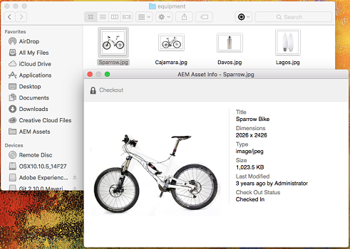
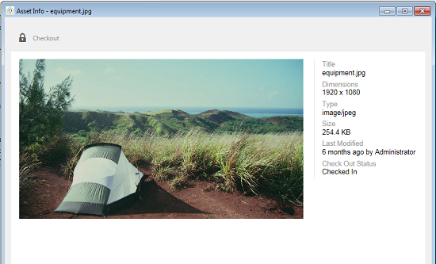
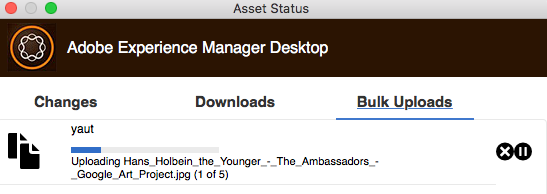

# 사용 [!DNL Experience Manager] 데스크탑 앱 v1.10 {#use-aem-desktop-app-v1x}

앱을 사용하여 [!DNL Experience Manager] 로컬 데스크탑에서 쉽게 액세스할 수 있으며 모든 데스크탑 애플리케이션에서 사용할 수 있습니다. 자산은 Mac Finder 또는 Windows 탐색기에서 쉽게 볼 수 있고 데스크탑 애플리케이션에서 열려 로컬로 변경될 수 있습니다. 변경 사항은 다시 [!DNL Experience Manager] 저장소에서 새 버전을 만들 수 있습니다.

이러한 통합을 통해 조직의 다양한 역할이 Assets에서 자산을 중앙에서 관리하고 Creative Cloud 및 기타 애플리케이션에서 액세스할 수 있으며 브랜딩을 비롯한 다양한 표준을 쉽게 준수할 수 있습니다.

를 사용하여 수행하는 주요 작업 [!DNL Experience Manager] 데스크탑 앱 v1에는 다음이 포함됩니다.

1. [연결 대상: [!DNL Experience Manager] server](#installandconnect)
1. [데스크탑에서 바로 자산 열기](#openondesktop)
1. [데스크탑에서 자산 편집 및 체크아웃](#workonassets)
1. [에셋 및 폴더 일괄 업로드](#bulkupload)

다양한 권장 할 수 있는 일과 하지 않는 일에 대해서는 [앱 사용 우수 사례](best-practices-for-v1.md). 앱을 사용하는 데 문제가 있는 경우 방법 을 참조하십시오. [문제 해결 [!DNL Experience Manager] 데스크탑](troubleshoot-app-v1.md).

>[!NOTE]
>
>데스크탑 앱은에 도입되었습니다. [!DNL Experience Manager] 6.1 릴리스 및 라고 함 [!DNL Experience Manager Assets Companion App].

## [!DNL Experience Manager] creative workflow의 데스크탑 앱 터치포인트 {#aem-desktop-app-touch-points-in-the-creative-workflow}

[!DNL Experience Manager] 데스크탑 앱과 함께 [!DNL Assets]는 크리에이티브 워크플로우에 통합되며 다음 터치 포인트를 제공합니다.

![[!DNL Experience Manager] 데스크탑 앱 터치포인트 크리에이티브 워크플로](assets/aem_desktopapp_workflow.png)

[!DNL Experience Manager] 데스크탑 앱 터치포인트 크리에이티브 워크플로

## 앱 설치 및 연결 대상 [!DNL Experience Manager] server {#installandconnect}

크리에이티브 자산을 만들거나 편집하기 전에 데스크탑 애플리케이션을 [!DNL Assets] 저장소에서 에셋을 다운로드하고 업로드하는 서버입니다. 다음 작업을 수행합니다.

1. [앱을 설치하십시오](#installapp).
1. [환경 설정 지정](#inapppref) 및 연결 세부 정보.
1. [에 연결 [!DNL Experience Manager] server](#connect) 및 를 로컬 드라이브로 자산 저장소를 마운트합니다.
1. [데스크탑 작업 활성화](#desktopactions) 날짜 [!DNL Experience Manager] 서버입니다.

[!DNL Experience Manager] 데스크탑 앱은 HTTPS 연결을 사용하여 [!DNL Experience Manager] 자산을 강력하고 안전하게 전송하는 서버입니다.

>[!NOTE]
>
>설치 및 구성 단계의 일부 또는 전부의 경우 [!DNL Experience Manager] 관리자 또는 시스템 관리자

### 애플리케이션 설치 {#installapp}

사용 [!DNL Experience Manager] 데스크탑 앱에서 [!DNL Experience Manager] 앱에서 서버 버전을 지원합니다. 운영 체제(Mac 또는 Windows)에 적합한 설치 파일(바이너리)을 다운로드하고 앱을 설치합니다.

네트워크 및 시스템 기본 설정에 따라 세부 구성이 필요할 수 있습니다. 다음을 참조하십시오 [설치 및 구성 [!DNL Experience Manager] 데스크탑 앱](install-configure-app-v1.md) 을 참조하십시오.

1. 로 이동 [[!DNL Experience Manager] 데스크탑 앱 v1.10 다운로드 페이지](/help/using/release-notes-of-v1.md) 운영 체제에 적합한 바이너리를 다운로드하십시오.
1. 다운로드한 설치 파일을 실행하고 화면의 지침에 따라 앱을 설치합니다.

   >[!NOTE]
   >
   >의 인스턴스 하나만 [!DNL Experience Manager] 데스크탑 앱을 한 번에 설치하고 활성화할 수 있습니다.

### 인앱 옵션 및 환경 설정 이해 {#inapppref}

응용 프로그램에서 연결 및 연결 해제 설정을 허용합니다. [!DNL Experience Manager] 서버, 업로드 상태 보기, 로컬 캐시 관리 등입니다. 기본 설정은 응용 프로그램의 일반 사용자에 대해 작동합니다. 설정을 수정하여 애플리케이션과 의 통합에서 더 많은 기능을 사용할 수 있습니다. [!DNL Experience Manager] 서버입니다. 다양한 설정은 아래에 자세히 설명되어 있습니다.

**자산 탐색** 다음 위치의 로컬 드라이브를 엽니다. [!DNL Assets] 저장소가 마운트되었습니다. 즉, 이제 로컬 컴퓨터에서 사용할 수 있게 된 자산을 살펴봅니다.

**에셋 상태 보기** 변경된 에셋이 업로드되거나 새 에셋이 [!DNL Assets] 저장소에서 백그라운드에 있는 에셋을 업로드합니다. 백그라운드 업로드를 사용하면 특히 크기가 큰 에셋의 경우 업로드가 완료될 때까지 기다리지 않고도 매끄러운 작업을 수행할 수 있습니다. 변경 내용을 로컬에 저장하고 삭제할 수 있습니다. 애플리케이션은 사용 가능한 대역폭에 따라 이러한 에셋을 서버로 전송하는 데 시간이 소요됩니다. 몇 가지 기본 정보와 함께 업로드 상태를 확인할 수 있습니다.

**옵션** 시스템이 시작될 때 응용 프로그램을 시작하는 설정에 액세스하려면 데스크탑 앱 트레이에서 옵션을 클릭하십시오. [!DNL Experience Manager] 앱이 시작될 때 및 로컬 드라이브 문자를 변경하려면 [!DNL Assets] 는 마운트 후에 사용할 수 있습니다.

**고급 > 캐시 관리** 로컬 캐싱에 사용할 수 있는 디스크 공간의 크기를 제어할 수 있습니다. 에서 가져온 아티팩트 [!DNL Assets] 더 원활한 경험을 위해 서버가 로컬에 캐시됩니다. 요구 사항에 맞게 기본값을 변경할 수 있습니다. 또한 캐시를 지우면 모든 에셋을 새로 가져올 수 있습니다. 캐시를 지우면 저장되지 않은 변경 사항이 유지됩니다. 체크인되지 않은 에셋 [!DNL Experience Manager] 서버는 유지되며 삭제되지 않습니다.

### 에 연결 [!DNL Experience Manager] server {#connect}

이 앱은 Mac 및 Windows에서 프록시 구성을 지원합니다. 앱이 시작될 때 구성이 읽혀집니다. 프록시 설정을 수정하는 경우 변경 내용을 적용하려면 앱을 다시 시작하십시오.

>[!NOTE]
>
>프록시 설정을 수정하는 경우 변경 내용을 적용하려면 앱을 다시 시작하십시오. 그렇지 않으면 앱에서 이전에 구성한 프록시 서버를 계속 사용합니다.

1. 시작 [!DNL Experience Manager] 데스크탑 앱입니다. 를 매핑하려면 [!DNL Experience Manager] 앱이 있는 인스턴스에서 [!DNL Experience Manager] 형식의 서버 `https://[aem-server-url]:[port]`.

   ![Mac에서 인증하고 [!DNL Experience Manager] 서버 URL](assets/aem_desktop_app_server_url.png)

1. 로그인 화면에서 인스턴스의 사용자 이름과 암호를 지정합니다. 대체를 지정하려면 [!DNL Experience Manager] 인스턴스를 선택하고 **[!UICONTROL Alternate Login URL]** 옵션을 선택합니다.

   ![제공 [!DNL Experience Manager] 의 로그인 화면에서 서버 자격 증명 [!DNL Experience Manager] 데스크탑 앱](assets/login_screen_v1.png)

### 에서 데스크톱 작업 활성화 [!DNL Experience Manager] 웹 인터페이스 {#desktopactions}

Assets 사용자 인터페이스 내에서 에셋 위치를 탐색하거나 데스크탑 애플리케이션에서 편집할 에셋을 체크아웃하고 열 수 있습니다. 이러한 옵션을 데스크탑 작업이라고 하며 기본적으로 활성화되어 있지 않습니다. 활성화하려면 다음 단계를 따르십시오.

1. Assets 인터페이스에서 도구 모음의 오른쪽 상단에 있는 사용자 아이콘을 클릭/탭합니다.
1. 클릭 **[!UICONTROL My Preferences]** 을(를) 표시하려면 **[!UICONTROL Preferences]** 대화 상자.

   ![[!DNL Experience Manager] 사용자 환경 설정을 사용한 인터페이스](assets/aem_ui_user_preferences.png)

1. 다음에서 [!UICONTROL User Preferences] 대화 상자, 선택 **[!UICONTROL Show Desktop Actions For Assets]**&#x200B;을 클릭한 다음 을 클릭합니다 **[!UICONTROL Accept]**.

   ![확인 [!UICONTROL Show Desktop Actions For Assets] 데스크탑 작업을 활성화하려면](assets/enable_desktop_actions.png)

   *그림: 확인 [!UICONTROL Show Desktop Actions For Assets] 바탕 화면 작업을 사용하도록 설정합니다.*

## 데스크탑에서 자산 액세스 및 열기 {#openondesktop}

다음을 클릭: **열기** 로컬 컴퓨터에서 자산을 열려면 앱이 해당 자산을 내부 캐시로 다운로드합니다. 이 앱은 다운로드한 에셋의 파일 유형과 연결된 기본 데스크탑 애플리케이션을 시작합니다.

Mac에서 **열기** 을 클릭하여 자산을 엽니다. [!DNL Experience Manager] 데스크탑 앱입니다. Windows의 경우 컨텍스트 메뉴에서 웹에서 열기 를 선택하여 에셋을 엽니다. 에셋 상태 창에서 을(를) 클릭/탭합니다.  를 클릭하여 자산을 엽니다.

Adobe InDesign(INDD) 파일의 경우 **[!UICONTROL Open]** 컨텍스트 메뉴 아래의 제품에서 사용할 수 있습니다. 이 옵션을 클릭하면 앱에서 연결된 자산을 로컬 파일 시스템에 다운로드한 다음 Adobe InDesign에서 INDD 파일을 엽니다. 이 방법을 사용하면 INDD 파일을 편집할 때 필요한 에셋을 로컬에서 사용할 수 있습니다.

![을 사용하여 에셋에 액세스하고 여는 컨텍스트 메뉴 옵션 [!DNL Experience Manager] 데스크탑 앱](assets/aem_desktopapp_mac_context_menu.png)

*그림: 를 사용하여 에셋에 액세스하고 여는 컨텍스트 메뉴 옵션 [!DNL Experience Manager] 데스크탑 앱입니다.*

>[!NOTE]
>
>Windows에서는 [기본 Windows 7 설정](https://support.microsoft.com/en-us/kb/2668751) 예방 [!DNL Experience Manager] 50MB보다 큰 자산을 처리할 수 있는 데스크탑 앱입니다.

<!-- TBD: The above note is for Windows 7 which is not supported by the app anymore. Remove it later.
-->

>[!NOTE]
>
>Adobe은 Mac의 파인더 보기 옵션으로 이동하여 옵션을 비활성화할 것을 권장합니다 **항목 정보 표시**, **항목 미리 보기 표시**, 및 **미리 보기 열 표시** 장착용 [!DNL Assets] 폴더를 삭제합니다. 성능이 향상됩니다.

### 의 추가 옵션 [!DNL Experience Manager] 인터페이스 {#additional-options-in-aem-assets}

를 매핑한 후 [!DNL Assets] 로컬 드라이브에 저장소가 있으면 매핑된 에셋 및 폴더에 대해 추가 아이콘과 폴더 업로드 기능을 사용할 수 있습니다.

1. 를 엽니다. [!DNL Assets] 인터페이스하고 포인터를 폴더 또는 자산 위에 두면 데스크탑 작업이 카드 보기에서 빠른 작업으로 표시됩니다.

   

   *그림: Assets UI에서 빠른 작업 메뉴를 열어 데스크탑 작업을 확인합니다.*

   다음 데스크탑 작업은 **데스크탑 작업** 옵션을 선택합니다. 이 옵션은 에셋을 선택한 후 또는 에셋 페이지의 도구 모음에서 선택합니다.

1. 특정 파일 확장명과 연결된 데스크톱 응용 프로그램에서 자산을 열려면 **데스크탑에서 열기** 빠른 작업 .

   또는 을 선택합니다 **열기** 다음에서 **데스크탑 작업** 도구 모음의 메뉴

로컬 파일 시스템에서 특정 자산을 찾으려면 **표시** 빠른 작업 . 또는 을 선택합니다 **표시** 다음에서 **데스크탑 작업** 도구 모음의 메뉴

## 에셋 상태 이해 {#understand-the-asset-statuses}

|  | 앱이 서버에 연결되고 모든 자산이 동기화됩니다. |
--- |--- |
|  | 앱이 시작되었지만 서버에 연결되어 있지 않습니다. 일부 에셋이 동기화 보류 중일 수 있습니다. |
|  | 에셋을 동기화하는 중입니다. 파일을 업로드하거나 다운로드하고 있습니다. 에셋 상태 창에서 정확한 상태를 보고 전송을 일시 중지할 수 있습니다. |
|  | 앱에서 다시 연결을 시도하고 있습니다. 네트워크 문제로 인해 연결이 끊어질 수 있습니다. |

## 에셋 작업 {#workonassets}

### 에서 에셋 체크아웃 [!DNL Experience Manager] 웹 인터페이스 {#check-out-assets-from-the-aem-web-interface}

[!DNL Assets] 편집을 위해 자산을 체크아웃하고 변경을 완료한 후 다시 체크인할 수 있도록 해 줍니다. 에셋을 체크 아웃한 후에는 에셋만 편집, 주석 달기, 게시, 이동 또는 삭제할 수 있습니다. 에셋을 체크 아웃하면 에셋이 잠기고 다른 사용자가 이러한 작업을 수행하지 못합니다. 에셋을 체크아웃/체크인하려면 에셋에 대한 쓰기 액세스 권한이 필요합니다.

에서 자산을 체크아웃하는 방법에는 두 가지가 있습니다. [!DNL Experience Manager] 웹 인터페이스. 첫 번째 방법에 대한 자세한 내용은 [자산 UI에서 파일 체크인 및 체크아웃](https://experienceleague.adobe.com/docs/experience-manager-65/assets/managing/check-out-and-submit-assets.html). 두 번째 방법인 경우 다음 단계에 따라 자산을 체크아웃하고 엽니다. [!DNL Experience Manager] 데스크탑 앱이 설치되었습니다.

1. 를 엽니다. [!DNL Assets] 인터페이스하고 포인터를 폴더 또는 자산 위에 두면 데스크탑 작업이 카드 보기에서 빠른 작업으로 표시됩니다.

   

   이러한 데스크탑 작업은 에셋을 선택한 후 또는 에셋 페이지의 도구 모음에서 데스크탑 작업 아이콘을 클릭/탭한 경우에도 사용할 수 있습니다.

1. 자산을 열려면 데스크탑에서 열기 빠른 작업을 클릭/탭합니다 .

   또는 도구 모음의 [데스크탑 작업] 메뉴에서 [열기]를 선택합니다.

   >[!NOTE]
   >
   >방금 열려 있고 체크 아웃되지 않은 파일을 편집하면 다른 사용자는 사용자가 에셋을 업데이트하고 있다는 것을 알 수 없습니다.

1. Adobe Creative Cloud 애플리케이션에서 편집할 자산을 열려면 데스크탑 편집 빠른 작업 을 클릭/탭합니다 . 편집할 에셋도 체크아웃합니다. 편집을 마치면 에셋을 체크 인하여에서 변경 사항을 업데이트합니다. [!DNL Assets].

   또는 도구 모음의 [데스크탑 작업] 메뉴에서 [편집]을 선택합니다.

1. 메뉴 열기 옵션을 선택합니다. 선택한 에셋이 미리보기 모드로 열립니다.
1. 에셋을 편집하려면 편집 옵션을 선택합니다. 에셋이 편집 모드로 열립니다.

### Mac OS의 Finder에서 에셋 체크아웃 {#check-out-assets-on-mac}

이 앱을 사용하면 다른 사용자가 작업 중인 파일을 수정하지 못하도록 자산 파일을 체크 아웃할 수 있습니다.

1. Mac 컨텍스트 메뉴에서 AEM Assets 폴더 열기 옵션을 선택하여 Finder를 엽니다.

   ![을 사용하여 에셋에 액세스하고 여는 컨텍스트 메뉴 옵션 [!DNL Experience Manager] 데스크탑 앱](assets/aem_desktopapp_mac_context_menu.png)

   *그림: 를 사용하여 에셋에 액세스하고 여는 컨텍스트 메뉴 옵션 [!DNL Experience Manager] 데스크탑 앱입니다.*

1. 체크 아웃할 에셋으로 이동합니다.
1. 에셋을 마우스 오른쪽 단추로 클릭하고 상황에 맞는 메뉴에서 추가 에셋 정보 를 선택합니다.
1. 에셋 정보 대화 상자에서 체크아웃 아이콘을 클릭/탭하여 에셋을 체크아웃합니다. 체크아웃 아이콘을 클릭/탭한 후 체크인 아이콘으로 전환됩니다.

   

1. 다른 사용자가 사용할 수 있도록 에셋을 체크 인하려면 에셋 정보 대화 상자에서 체크 인 아이콘을 클릭/탭합니다.

### Windows에서 에셋 체크아웃 {#check-out-assets-on-windows}

이 앱을 사용하면 다른 사용자가 작업 중인 파일을 수정하지 못하도록 자산 파일을 체크 아웃할 수 있습니다.

1. 컨텍스트 메뉴에서 자산 탐색을 선택하여 탐색기를 엽니다.
1. 탐색기에서 체크 아웃할 자산의 위치로 이동합니다.
1. 자산을 마우스 오른쪽 단추로 클릭하고 상황에 맞는 메뉴에서 웹에서 열기를 선택합니다.
1. 에셋 정보 대화 상자에서 체크아웃 아이콘을 클릭/탭합니다. 체크아웃 아이콘은 체크인 아이콘으로 전환됩니다.

   

1. 탐색기에서 에셋을 검토합니다. 에셋의 잠금 아이콘  자산을 체크아웃했음을 나타냅니다.

   >[!NOTE]
   >
   >잠금 아이콘은 잠시 후에 나타날 수 있습니다. [!DNL Experience Manager] desktop app은 빠른 액세스를 위해 자산을 캐시하므로 잠긴 상태를 업데이트하는 데 몇 분 정도 걸릴 수 있습니다.

1. 다른 사용자가 사용할 수 있도록 에셋을 체크 인하려면 다음에서 체크 인 아이콘을 클릭/탭합니다. **자산 정보** 대화 상자.

### Finder 또는 Explorer와 웹 인터페이스를 사용하여 에셋 체크인 {#check-in-an-asset-using-finder-or-explorer-and-using-web-interface}

에셋 편집을 마치면 에셋을 데스크탑 애플리케이션에 저장합니다. 컨텍스트 메뉴에서 을(를) 선택합니다 **추가 에셋 정보** 체크 인을 클릭합니다.

에셋이에 업로드됩니다. [!DNL Experience Manager] 서버입니다. 선택적으로 을 선택하여 업로드 상태를 확인할 수 있습니다. **에셋 상태 보기** 시스템 트레이 아이콘으로 표시합니다. 또는 다음에서 자산을 체크 인할 수 있습니다. [!DNL Experience Manager] 웹 인터페이스. 체크아웃된 에셋을 클릭하거나 선택합니다. 도구 모음에서 체크 인 아이콘을 클릭합니다 .

에셋이에 업로드됨 [!DNL Experience Manager] 변경 사항이 로컬에 저장되면 자동으로 저장됩니다. 이 체크 인은 다른 사용자가 에셋을 사용할 수 있도록 합니다. [!DNL Experience Manager] 편집할 사용자.

### 에셋 및 폴더 일괄 업로드 [!DNL Experience Manager] server {#bulkupload}

사용 [!DNL Experience Manager] 데스크탑 앱에서는 로컬 파일 디렉토리에서 자산이 포함된 전체 폴더를 [!DNL Assets]. 이렇게 하면 폴더 내의 모든 에셋을 한 번에 하나씩 업로드할 필요 없이 일괄 업로드합니다.

1. 에셋 UI에서 을 클릭/탭합니다 **만들기** 을 클릭하고 **업로드 폴더** 메뉴에서 삭제할 수 있습니다.
1. 업로드할 폴더를 찾아 선택합니다.
1. 확인 을 클릭/탭합니다. 에셋 상태 대화 상자에 업로드 상태가 표시됩니다.

   

   에셋 상태 창에서 업로드 상태 보기

   >[!NOTE]
   >
   >해당 아이콘을 클릭/탭하여 업로드를 수동으로 일시 중지하거나 취소할 수 있습니다.

1. 폴더가 업로드되면 대화 상자를 닫고 에셋 UI로 이동합니다. 업로드된 폴더가 웹 인터페이스에 표시됩니다.

Adobe은 로컬 파일 시스템에서 네트워크 공유 영역으로 더 많은 수의 파일 또는 중첩된 폴더를 복사-붙여넣거나 드래그하지 않는 것이 좋습니다. 앱은 기술적 한계로 인해 업로드 프로세스를 제어할 수 없고 성능이 떨어집니다.

또는 업로드할 파일/폴더를 선택합니다 [!DNL Experience Manager] finder 또는 Explorer에서 시스템 클립보드에 복사하고 네트워크 공유 영역의 대상 폴더로 이동한 다음, [!DNL Experience Manager] 데스크탑 앱 컨텍스트 메뉴 선택 **자산 붙여넣기**. 이쪽으로, [!DNL Experience Manager] 데스크탑 앱은 과 유사하게 붙여넣은 에셋 업로드를 시작합니다. **업로드 폴더** 옵션이에서 사용할 수 있음 [!DNL Experience Manager] 웹 인터페이스.

>[!MORELIKETHIS]
>
>* [문제 해결 [!DNL Experience Manager] 데스크탑 앱 애플리케이션](troubleshoot-app-v1.md)
