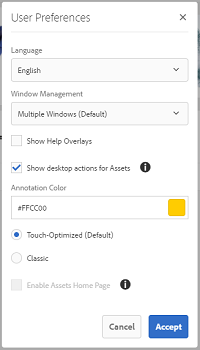
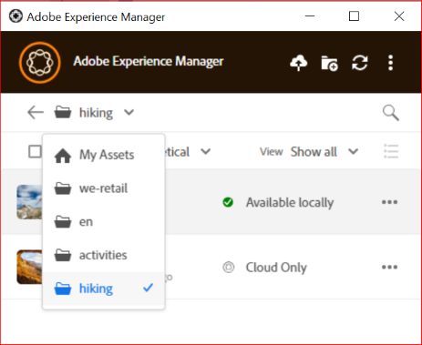
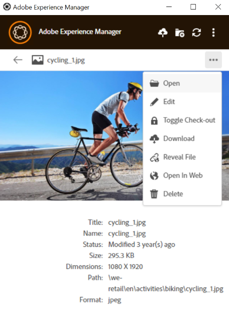
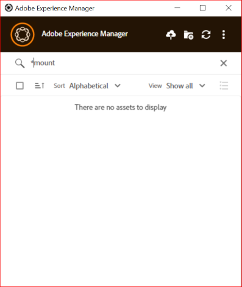
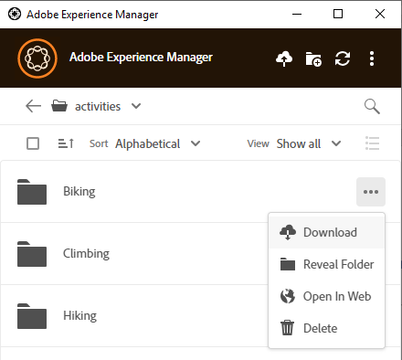
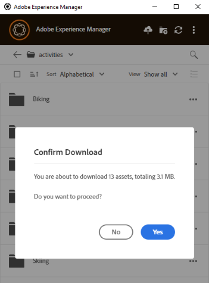
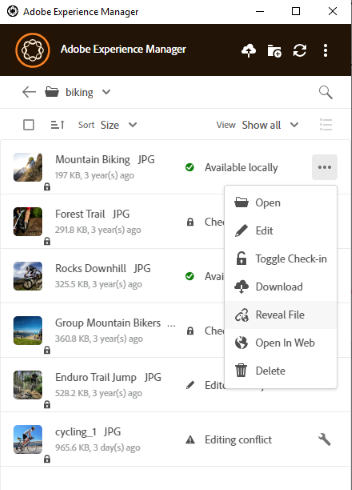
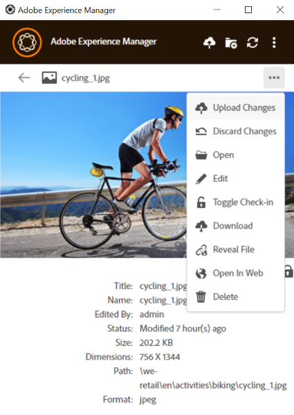
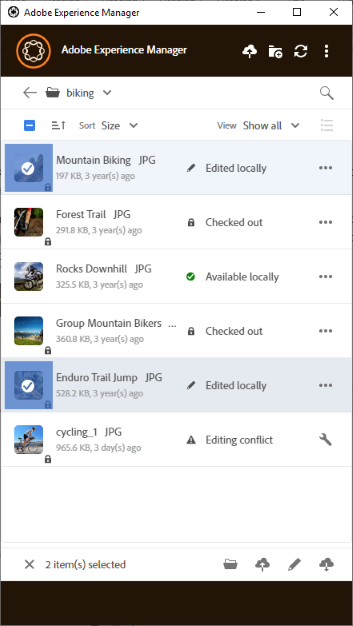
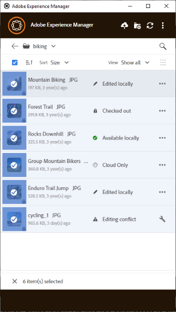

# 사용 [!DNL Adobe Experience Manager] 데스크탑 앱 {#use-aem-desktop-app-v2}

사용 [!DNL Adobe Experience Manager] 데스크탑 앱: 저장된 디지털 자산에 쉽게 액세스 [!DNL Adobe Experience Manager] 로컬 데스크탑의 DAM 저장소를 사용하여 모든 데스크탑 애플리케이션에서 이러한 에셋을 사용합니다. 데스크탑 애플리케이션에서 자산을 열고 자산을 로컬로 편집할 수 있습니다. 변경 사항을 다시 업로드하십시오. [!DNL Experience Manager] 버전 제어로 다른 사용자와 업데이트를 공유할 수 있습니다. 새 파일 및 폴더 계층을 업로드할 수도 있습니다. [!DNL Experience Manager], 폴더 만들기 및 자산 또는 폴더 삭제 [!DNL Experience Manager] DAM.

통합을 통해 조직에서 다양한 역할이 의 자산을 중앙에서 관리할 수 있습니다. [!DNL Experience Manager Assets] Windows 또는 Mac OS의 기본 애플리케이션에서 로컬 데스크탑의 자산에 액세스할 수 있습니다.

로그아웃한 후 또는 처음으로 애플리케이션을 열 때 의 URL을 입력합니다. [!DNL Experience Manager] 형식의 서버 `https://[aem-server-url]:[port]/`. 그런 다음 를 선택합니다. [!UICONTROL Connect] 옵션을 선택합니다. 앱을 서버에 연결하기 위한 자격 증명을 제공합니다.

를 사용하여 수행하는 주요 작업 [!DNL Adobe Experience Manager] 데스크탑 앱은 다음과 같습니다.

![을 사용하여 수행할 수 있는 워크플로 및 작업 [!DNL Experience Manager] 데스크탑 앱](assets/aem_desktop_app_usecases_v2.png "을 사용하여 수행할 수 있는 워크플로 및 작업 [!DNL Adobe Experience Manager] 데스크탑 앱")

다운로드 [이](assets/aem_desktop_app_usecases_print.pdf) 인쇄 준비 PDF 파일입니다.

## 데스크탑 앱 작동 방식 {#how-app-works2}

응용 프로그램 사용을 시작하기 전에 다음을 이해합니다. [앱 작동 방식](release-notes.md#how-app-works). 또한 다음 용어를 숙지하십시오.

* **[!UICONTROL Desktop Actions]**: Assets 웹 인터페이스에서 브라우저의 내부 자산 위치를 탐색하거나 체크아웃하고 기본 데스크탑 애플리케이션에서 편집할 자산을 열 수 있습니다. 이러한 작업은 웹 인터페이스에서 사용할 수 있으며, 데스크톱 앱 기능을 사용합니다. 다음을 참조하십시오 [데스크탑 작업을 활성화하는 방법](using.md#desktopactions-v2).

* 파일 상태: **[!UICONTROL Cloud Only]**: 이러한 에셋은 로컬 컴퓨터에서 다운로드되지 않고에서 사용할 수 있습니다. [!DNL Experience Manager] 서버만.

* 파일 상태: **[!UICONTROL Available locally]**: 에셋이 다운로드되고 로컬 시스템에서 그대로 사용할 수 있습니다. 자산은 변경되지 않습니다.

* 파일 상태: **[!UICONTROL Edited locally]**: 이러한 에셋은 로컬에서 수정되며 변경 사항은 업로드된 위치에 그대로 유지됩니다. [!DNL Experience Manager] 서버입니다. 업로드한 후에는 상태가 (으)로 변경됩니다. [!UICONTROL Available locally]. 다음을 참조하십시오 [에셋 편집](using.md#edit-assets-upload-updated-assets).

* 파일 상태: **[!UICONTROL Editing conflict]**: 사용자와 다른 사용자가 자산을 동시에 수정하는 경우, 앱은 편집 충돌이 발생했음을 나타냅니다. 또한 앱은 변경 내용을 유지하거나 취소할 수 있는 옵션을 제공합니다. 다음을 참조하십시오 [편집 충돌을 피하는 방법](using.md#adv-workflow-collaborate-avoid-conflicts).

* 파일 상태: **[!UICONTROL Modified remotely]**: 앱은 다운로드한 에셋이 [!DNL Experience Manager] 서버입니다. 이 앱은 최신 버전을 다운로드하고 로컬 복사본을 업데이트하는 옵션도 제공합니다. 다음을 참조하십시오 [편집 충돌을 피하는 방법](using.md#adv-workflow-collaborate-avoid-conflicts).

* **[!UICONTROL Check-out]**: 파일을 편집하거나 편집하려는 경우 상태를 체크 아웃으로 전환합니다. 앱의 에셋에 잠금 아이콘을 추가하고 [!DNL Experience Manager] 웹 인터페이스. 잠금 아이콘은 동일한 에셋을 동시에 편집하면 편집 충돌이 발생하는 것을 방지하기 위해 다른 사용자에게 표시됩니다.

* **[!UICONTROL Check-in]**: 다른 사용자가 편집 충돌 없이 편집할 수 있도록 자산을 안전한 것으로 표시합니다. 변경 사항을 업로드할 때 잠금 아이콘이 자동으로 제거됩니다. 체크 인 상태를 전환하면 잠금 아이콘도 제거되지만 변경 사항을 업로드하지 않고 수동으로 체크 인하지 않는 것이 좋습니다. 변경 사항을 취소하는 경우 체크 인을 수동으로 전환합니다.

* **[!UICONTROL Open]** 작업: 에셋을 열어 기본 애플리케이션에서 미리 보십시오. 자산을 체크아웃하지 않고 다른 사용자가 편집할 수 있으므로 이 작업을 사용하여 자산을 편집하지 않는 것이 좋습니다. 편집 시 충돌이 발생할 수 있기 때문입니다.

* **[!UICONTROL Edit]** 작업: 작업을 사용하여 이미지를 수정합니다. 클릭 [!UICONTROL Edit] 작업이 에셋을 자동으로 체크아웃하고 에셋에 잠금 아이콘을 추가합니다. 편집 을 클릭한 후 에셋을 편집하지 않으려면 을 클릭합니다 [!UICONTROL Toggle check-in]. 에서 에셋을 삭제, 이름 변경 또는 이동하려면 [!DNL Experience Manager] DAM 폴더 계층 구조입니다. [!DNL Experience Manager] 편집 작업이 아닌 웹 인터페이스 작업.

* **[!UICONTROL Download]** 작업: 로컬 컴퓨터에 자산을 다운로드합니다. 지금 에셋을 다운로드하고 나중에 편집할 수 있습니다. 오프라인으로 작업하고 나중에 변경 사항을 업로드할 수 있습니다. 에셋은 파일 시스템의 캐시 폴더에 다운로드됩니다.

* **[!UICONTROL Reveal File]** 또는 **[!UICONTROL Reveal Folder]** 작업: 자산이 로컬 캐시 폴더로 다운로드되는 동안 앱은 로컬 네트워크 드라이브를 모방하고 각 자산에 대한 로컬 경로를 제공합니다. 이 경로를 알려면 앱에서 적절한 표시 옵션을 사용합니다. 자산을 Creative Cloud 애플리케이션에 배치하는 데 표시 작업이 필요합니다. 다음을 참조하십시오 [자산 배치](using.md#place-assets-in-native-documents).

* **[!UICONTROL Open In Web]** 작업: 에셋을 보려면 [!DNL Experience Manager] 웹 인터페이스, 웹에서 엽니다. 에서 더 많은 워크플로우를 시작할 수 있습니다. [!DNL Experience Manager] 메타데이터 또는 에셋 검색 업데이트와 같은 인터페이스입니다.

* **[!UICONTROL Delete]** 작업: 에셋에서 에셋 삭제 [!DNL Experience Manager] DAM 리포지토리. 이 작업은 Experience Manager 서버에 있는 에셋의 원본 복사본을 삭제합니다. 로컬 자산에 대한 수정 사항만 취소하려면 [변경 내용 버리기](using.md#edit-assets-upload-updated-assets).

* **[!UICONTROL Upload Changes]**: 데스크탑 앱은에 명시적으로 업로드할 때만 업데이트된 에셋을 업로드합니다. [!DNL Experience Manager] 서버입니다. 편집 내용을 저장하면 변경 내용이 로컬 컴퓨터에만 저장됩니다. 업로드할 때 에셋이 자동으로 체크 인되고 잠금 아이콘이 제거됩니다. 다음을 참조하십시오 [에셋 편집](using.md#edit-assets-upload-updated-assets).

## 에서 데스크톱 작업 활성화 [!DNL Experience Manager] 웹 인터페이스 {#desktopactions-v2}

다음 범위 내에서 [!DNL Assets] 사용자 인터페이스 브라우저에서 자산 위치를 탐색하거나 데스크탑 애플리케이션에서 편집할 자산을 체크아웃하고 열 수 있습니다. 이러한 옵션을 라고 합니다. [!UICONTROL Desktop Actions] 및 은 기본적으로 활성화되어 있지 않습니다. 활성화하려면 다음 단계를 수행합니다.

1. 다음에서 [!DNL Assets] 콘솔을 클릭하고 **[!UICONTROL User]** 아이콘을 클릭합니다.
1. 클릭 **[!UICONTROL My Preferences]** 을(를) 표시하려면 **[!UICONTROL Preferences]** 대화 상자.

1. 다음에서 [!UICONTROL User Preferences] 대화 상자, 선택 **[!UICONTROL Show Desktop Actions For Assets]**&#x200B;을 클릭한 다음 을 클릭합니다 **[!UICONTROL Accept]**.

   

   *그림: 선택 [!UICONTROL Show Desktop Actions For Assets] 바탕 화면 작업을 사용하도록 설정합니다.*

## 에셋 검색 및 미리 보기 {#browse-search-preview-assets}

에서 사용할 수 있는 에셋을 찾아보고 검색하고 미리 볼 수 있습니다. [!DNL Experience Manager] 모든 리포지토리를 데스크탑 애플리케이션 내에서 가져옵니다. 앱에서 다음을 시도해 보십시오.

1. 폴더를 탐색하여 모든 에셋의 작은 썸네일과 함께 폴더에서 사용할 수 있는 에셋에 대한 몇 가지 기본 정보를 확인합니다.

   

1. 개별 에셋에 대한 더 많은 정보와 더 큰 썸네일을 보려면 파일 이름을 클릭합니다.

   

1. 클릭 **[!UICONTROL Open]** 또는 **[!UICONTROL Edit]** 파일을 로컬로 다운로드하고 각각 기본 애플리케이션에서 보거나 편집할 수 있습니다.
1. 키워드를 사용하여 검색하여에서 관련 에셋 찾기 [!DNL Experience Manager] 리포지토리. 사용 `?` 및 `*` 와일드카드로. 이러한 와일드카드는 각각 단일 문자 또는 여러 문자를 대체합니다. 필요에 따라 결과를 필터링하고 정렬합니다.

   

   

>[!NOTE]
>
>이 앱은 에셋의 제목이나 파일 이름뿐만 아니라 여러 메타데이터 필드에서 검색 기준을 일치시켜 에셋을 표시합니다.

## 자산 다운로드 {#download-assets}

로컬 파일 시스템에서 에셋을 다운로드할 수 있습니다. 앱에서 자산을 가져옵니다. [!DNL Experience Manager] 로컬 파일 시스템에 동일한 복제본을 저장하고 서버에 저장합니다.

클릭  옵션을 보려면 다음을 클릭하십시오.  다운로드.

>[!NOTE]
>
>큰 파일 또는 많은 파일을 다운로드하거나 업로드할 때 애플리케이션은 에셋 및 폴더에 대한 작업을 끕니다. 다운로드 또는 업로드가 완료되면 작업을 사용할 수 있습니다.

큐 크기가 크거나 네트워크 문제가 있는 경우 여러 자산을 다운로드하면 성능이 저하될 수 있습니다. 또한 폴더를 다운로드할 때 모르는 사이에 많은 에셋을 다운로드용으로 대기열에 넣을 수 있습니다. 긴 대기 시간을 방지하기 위해 앱에서는 한 번에 다운로드되는 에셋의 수를 제한합니다. 구성 방법은 다음을 참조하십시오. [환경 설정 지정](install-upgrade.md#set-preferences). 이 제한 미만이더라도 앱이 겉보기에 큰 폴더를 다운로드하기 전에 확인을 요청할 수 있습니다.

폴더를 선택하고 다운로드하면 애플리케이션에서 의 폴더에 직접 저장된 자산만 다운로드합니다 [!DNL Experience Manager]. 하위 폴더에서 에셋을 자동으로 다운로드하지는 않습니다.

## 데스크탑에서 자산 열기 {#openondesktop-v2}

기본 애플리케이션에서 볼 원격 자산을 열 수 있습니다. 에셋이 로컬 폴더로 다운로드되고 파일 형식과 연결된 기본 애플리케이션에서 실행됩니다. 기본 응용 프로그램을 변경하여 Mac 또는 Windows에서 특정 파일 형식(확장명)을 열 수 있습니다.

클릭 **[!UICONTROL Open]** 에셋 메뉴에서 에셋이 로컬로 다운로드되고 기본 애플리케이션에서 열립니다. 상태 표시줄에서 대형 에셋의 다운로드 진행률 및 전송 속도를 확인합니다.

<!-- 
-->

>[!NOTE]
>
>예상되는 변경 사항이 앱에 반영되지 않으면 새로 고침 아이콘을 클릭합니다  또는 앱 인터페이스를 마우스 오른쪽 버튼으로 클릭하고 **[!UICONTROL Refresh]**. 더 큰 규모의 다운로드나 업로드가 진행되는 동안에는 작업을 사용할 수 없습니다.

에셋의 로컬 다운로드 폴더를 열려면  및 클릭  **[!UICONTROL Reveal File]** 작업.

## 기본 문서에 에셋 사용 또는 배치 {#place-assets-in-native-documents}

경우에 따라 에셋을 기본 문서에 배치할 때 Windows 탐색기 또는 Mac Finder의 파일에 액세스합니다. 로컬로 다운로드한 파일의 파일 시스템 위치로 이동하려면  **[!UICONTROL Reveal File]** 옵션을 선택합니다.

클릭 **[!UICONTROL Reveal File]**, 또는 **[!UICONTROL Reveal Folder]** 폴더에서 로컬 컴퓨터에서 파일이나 폴더를 미리 선택한 상태로 Windows 탐색기 또는 Mac Finder를 엽니다. 옵션은 다음과 같은 경우에 유용합니다. [!DNL Experience Manager] 로컬 파일의 배치나 연결을 지원하는 기본 응용 프로그램의 파일. Adobe InDesign에 파일을 배치하는 방법을 보려면 [그래픽 배치](https://helpx.adobe.com/indesign/using/placing-graphics.html).

다음 **[!UICONTROL Reveal File]** 작업은 로컬에서 사용할 수 있는 에셋, 즉 앱을 사용하여 공개, 다운로드 또는 열거나 편집한 에셋만 표시하는 로컬 네트워크 공유를 엽니다. 로컬 네트워크 공유가에 대한 변경 사항을 업로드하지 않습니다. [!DNL Experience Manager]. 변경 사항을 업로드하려면 를 명시적으로 사용합니다. **[!UICONTROL Upload Changes]** 또는 **[!UICONTROL Upload]** 앱의 작업입니다.

>[!NOTE]
>
>이전 버전과의 호환성을 위해 [!DNL Experience Manager] 표시된 파일은 로컬 네트워크 공유에서 제공되므로 로컬에서 사용 가능한 파일만 노출됩니다. 표시된 파일의 데스크탑 경로는 앱 v1.x에서 만든 경로와 동일합니다.

>[!CAUTION]
>
>사용하지 않음 **[!UICONTROL Reveal File]** 기본 애플리케이션에서 자산을 편집하는 옵션입니다. 대신 **[!UICONTROL Edit]** 작업. 자세한 내용은 [고급 워크플로우: 동일한 파일에 대해 공동 작업하고 편집 충돌 방지](#adv-workflow-collaborate-avoid-conflicts).

## 에셋 편집 및 업데이트된 에셋 업로드 [!DNL Experience Manager] {#edit-assets-upload-updated-assets}

변경 작업을 수행하고 업데이트된 에셋을 Experience ManagerEM 서버에 업로드하려면 편집할 에셋을 엽니다. 다른 사용자의 편집과 충돌을 방지하려면 앱을 사용하여 편집 세션을 시작하십시오. 편집을 시작하기 전에 에셋에 잠금 아이콘이 없는지 확인합니다. 즉, 다른 사용자가 에셋을 편집하고 있지 않은지 확인합니다.

에셋을 편집하려면 에셋을 검색하거나 에셋의 위치를 찾습니다. 클릭  및 클릭 **[!UICONTROL Edit]**.

사용 **[!UICONTROL Toggle Check-out]** 다음 두 상황에서 다른 사용자의 편집과 충돌하지 않도록 자산을 잠그려면 다음을 수행하십시오.

* 자산을 먼저 체크아웃하지 않고 편집을 시작했습니다(자산을 열기만 하면 됨).
* 에셋 편집을 곧 시작하고 다른 사용자가 편집하지 않도록 하려는 경우

편집을 마치면 앱에 **[!UICONTROL Edited Locally]** 변경된 에셋의 상태입니다. 에셋에 저장된 모든 변경 사항은 변경 사항을 업로드할 때까지 로컬 전용입니다. [!DNL Experience Manager]. 개별 또는 몇 개의 에셋을 하나씩 업로드하려면 **[!UICONTROL Upload Changes]** 을 선택합니다. 에셋의 버전을 생성합니다. [!DNL Experience Manager]. 의 웹 인터페이스 사용 [!DNL Assets]에서 에셋 내역을 볼 수 있습니다. [타임라인 보기](https://experienceleague.adobe.com/docs/experience-manager-65/assets/using/activity-stream.html).

공동 편집에 대한 우수 사례는 을 참조하십시오. [고급 워크플로우: 동일한 파일에 대해 공동 작업하고 편집 충돌 방지](#adv-workflow-collaborate-avoid-conflicts).

다음과 같은 경우 로컬 자산에 대한 변경 사항 및 편집 내용을 취소할 수 있습니다. **[!UICONTROL Discard Changes]**&#x200B;를 클릭합니다.

* 에서 로컬 변경 사항을 저장하지 않으려면 [!DNL Experience Manager].
* 일부 변경 내용을 저장한 후 원래 에셋에서 변경 작업을 시작합니다.
* 더 이상 필요하지 않으므로 자산 편집을 중지합니다.

필요한 경우 체크 아웃을 전환합니다. 업데이트된 자산은 로컬 캐시 폴더에서 제거되고, 편집하거나 열 때 다시 다운로드됩니다.

## 새 에셋 업로드 및 추가 [!DNL Experience Manager] {#upload-and-add-new-assets-to-aem}

사용자는 DAM 저장소에 새 에셋을 추가할 수 있습니다. 예를 들어 사진 촬영에서 사진으로 많은 수의 사진을 추가하려는 에이전시 사진작가 또는 계약자일 수 있습니다. [!DNL Experience Manager] 리포지토리. 새 컨텐츠를 추가할 위치 [!DNL Experience Manager], 선택  앱의 상단 표시줄에서 을 클릭합니다. 로컬 파일 시스템에서 에셋 파일을 찾아 **[!UICONTROL Select]**. 또는 에셋을 업로드하려면 애플리케이션 인터페이스에서 파일이나 폴더를 드래그합니다. Windows에서 앱 내의 폴더에 자산을 드래그하면 자산이 폴더에 업로드됩니다. 업로드하는 데 시간이 오래 걸리는 경우 앱에 진행률 표시줄이 표시됩니다.

<!-- 
-->

로컬 파일 시스템에서 폴더 또는 개별 파일을 업로드할 수 있습니다. 업로드 시 폴더의 계층 구조가 유지됩니다. 자산을 일괄적으로 업로드하기 전에 다음을 참조하십시오. [일괄 업로드](#bulk-upload-assets).

주어진 세션에서 전송된 에셋 목록을 보려면 **[!UICONTROL View]** > **[!UICONTROL Assets transfers]**. 목록을 사용하면 현재 세션의 파일 전송을 보고 신속하게 확인할 수 있습니다.

에서 업로드 동시성(가속)을 제어할 수 있습니다. **[!UICONTROL Preferences]** > **[!UICONTROL Upload acceleration]** 설정. 동시성이 높으면 일반적으로 업로드 속도가 빨라지지만 리소스가 많이 소모되고 로컬 컴퓨터의 처리 능력이 더 많이 소모될 수 있습니다. 시스템이 느려진 경우 더 낮은 동시성 값을 사용하여 업로드를 다시 시도합니다.

>[!NOTE]
>
>전송 목록이 지속적이지 않으며 앱을 종료한 후 다시 열면 사용할 수 없습니다.

### 자산 이름의 특수 문자 관리 {#special-characters-in-filename}

레거시 앱에서 리포지토리에서 만든 노드 이름은 사용자가 제공한 폴더 이름의 공백과 대/소문자를 유지합니다. 현재 응용 프로그램에서 v1.10 앱의 노드 이름 지정 규칙을 에뮬레이트하려면 다음을 활성화합니다 [!UICONTROL Use legacy conventions when creating nodes for assets and folders] 다음에서 [!UICONTROL Preferences]. 다음을 참조하십시오 [앱 환경 설정](/help/using/install-upgrade.md#set-preferences). 이 레거시 환경 설정은 기본적으로 비활성화되어 있습니다.

>[!NOTE]
>
>이 앱은 다음 이름 지정 규칙을 사용하여 저장소의 노드 이름만 변경합니다. 앱은 `Title` 있는 그대로 에셋.

<!-- TBD: Do NOT use this table.

| Where do characters occur | Characters | Legacy preference | Renaming convention | Example |
|---|---|---|---|---|
| In file name extension | `.` | Enabled or disabled | Retained as is | NA |
| File or folder name | `. / : [ ] | *` | Enabled or disabled | Replaced with a `-` (hyphen) | `myimage.jpg` remains as is and `my.image.jpg` changes to `my-image.jpg`. |
| Folder name | `% ; # , + ? ^ { } "` | Disabled | Replaced with a `-` (hyphen) | tbd |
| File name | `% # ? { } &` | Disabled | Replaced with a `-` (hyphen) | tbd |
| File name | Whitespaces | Enabled or disabled | Retained as is | NA |
| Folder name | Whitespaces | Disabled | Replaced with a `-` (hyphen) | tbd |
| File name | Uppercase characters | Disabled | Retained as is | tbd |
| Folder name | Uppercase characters | Disabled | Replaced with a `-` (hyphen) | tbd |
-->

| 문자 ‡ | 앱의 이전 환경 설정 | 파일 이름에 발생할 때 | 폴더 이름에서 발생하는 경우 | 예 |
|---|---|---|---|---|
| `. / : [ ] \| *` | 활성화 또는 비활성화 | (으)로 대체됨 `-` (하이픈). A `.` 파일 이름 확장자의 (점)은 그대로 유지됩니다. | (으)로 대체됨 `-` (하이픈). | `myimage.jpg` 있는 그대로 및 로 유지 `my.image.jpg` 변경 사항 `my-image.jpg`. |
| `% ; # , + ? ^ { } "` 및 공백 |  비활성화됨 | 공백은 유지됩니다 | (으)로 대체됨 `-` (하이픈). | `My Folder.` 변경 사항 `my-folder-`. |
| `# % { } ? & .` |  비활성화됨 | (으)로 대체됨 `-` (하이픈). | 나. | `#My New File.` 변경 사항 `-My New File-`. |
| 대문자 |  비활성화됨 | 케이스는 그대로 유지됩니다. | 소문자로 변경되었습니다. | `My New Folder` 변경 사항 `my-new-folder`. |
| 대문자 |  활성화됨 | 케이스는 그대로 유지됩니다. | 케이스는 그대로 유지됩니다. | 나. |

‡ 문자 목록은 공백으로 구분된 목록입니다.

<!-- TBD: Check if the following is to be included in the footnote.

Do not use &#92;&#92; in the names of files and &#92;&#116; &#38; in the names of folders. 
-->

<!-- TBD: Securing the below presentation of the same content in a comment.

**File names**

| Characters | Replaced by |
|---|---|
| &#35; &#37; &#123; &#63; &#125; &#38; &#46; &#47; &#58; &#91; &#124; &#93; &#42; | hyphen (-) |
| whitespaces | whitespaces are retained |
| capital case | casing is retained |

>[!CAUTION]
>
>Avoid using &#92;&#92; in file names.

**Folder names**

| Characters | Replaced by |
|---|---|
| Characters | Replaced by |
| &#37; &#59; &#35; &#44; &#43; &#63; &#94; &#123; &#123; &#34; &#46; &#47; &#59; &#91; &#93; &#124; &#42; | hyphen (-) |
| whitespaces | hyphen (-) |
| capital case | lower case |

>[!CAUTION]
>
>Avoid using &#92;&#92; &#92;&#116; &#38; in folder names.

>[!NOTE]
>
>If you enable [!UICONTROL Use legacy conventions when creating nodes for assets and folders] in app [!UICONTROL Preferences], then the app emulates v1.10 app behavior when uploading folders. In v1.10, the node names created in the repository respect spaces and casing of the folder names provided by the user. For more information, see [app Preferences](/help/using/install-upgrade.md#set-preferences).

-->

## 여러 자산을 사용한 작업 {#work-with-multiple-assets}

사용자는 한 번에 모든 편집 내용을 업로드하거나 몇 번의 클릭으로 중첩된 폴더를 업로드하는 등의 작업을 사용하여 여러 에셋으로 쉽게 작업하고 관리할 수 있습니다.

### 큰 폴더 찾아보기 {#browse-large-folders}

많은 에셋이 포함된 폴더를 사용하여 작업할 때 스크롤하여 더 많은 에셋을 볼 수 있습니다. 키보드를 사용하여 스크롤하려면 Tab을 몇 번 눌러 맨 위에 있는 에셋을 선택합니다. 강조 표시된 에셋이 언제 선택되었는지 확인합니다. 이제 아래쪽 화살표 키를 사용하여 에셋 목록을 이동합니다.

### 선택한 자산에 대한 빠른 작업 {#quick-actions-for-selected-assets}

몇 개의 에셋에 대한 축소판을 클릭하여 에셋을 선택합니다. 모든 에셋을 선택하려면 앱의 상단 표시줄에서 확인란을 클릭합니다. 선택한 모든 에셋에 일괄적으로 적용할 수 있는 작업 세트는 앱 하단의 도구 모음에 표시됩니다.

하단의 도구 모음에서 사용할 수 있는 작업은 선택한 파일의 상태에 따라 다릅니다. 예를 들어 **[!UICONTROL Edited Locally]** 파일, 다음을 참조: **[!UICONTROL Upload Changes]** 아이콘. 다음을 혼합하여 선택한 경우 **[!UICONTROL Edited locally]** 및 **[!UICONTROL Cloud only]**, **[!UICONTROL Upload Changes]** 작업을 사용할 수 없습니다.

### 편집된 모든 이미지 찾기 {#find-all-edited-images}

이 애플리케이션은 라는 뷰를 제공합니다. **[!UICONTROL Edited locally]**&#x200B;를 사용하여 로컬에서 다운로드한 모든 파일에 빠르게 액세스할 수 있습니다 [!UICONTROL Open] 또는 [!UICONTROL Edit] 작업)을 수행한 다음 수정합니다. 앱을 사용하면 몇 번의 클릭으로 로컬에서 편집한 모든 자산을 선택하고 변경 사항을 업로드할 수 있습니다. 이 보기는 편집 충돌이 있는 로컬로 편집된 에셋도 표시합니다.

.")

### 자산 일괄 업로드 {#bulk-upload-assets}

사진 작가 또는 광고 에이전시와 같은 사용자 또는 조직은 밖에서 수행한 더 큰 세트에서 사진 촬영, 수정 또는 선택과 같은 시나리오에서 수많은 현지 자산을 만들 수 있습니다 [!DNL Experience Manager]. 이러한 큰 로컬 폴더를에 업로드할 수 있습니다. [!DNL Assets] 바로 데스크탑 앱에서 가져옵니다. 폴더 계층은 유지되고 중첩된 모든 하위 폴더와 포함된 에셋이 업로드됩니다. 업로드된 에셋은 동일한 서버의 다른 사용자도 즉시 사용할 수 있습니다. 에셋이 백그라운드로 업로드되므로 작업이 웹 브라우저 세션에 연결되지 않습니다.

![데스크톱에서 여러 로컬 폴더를 로 일괄 업로드 [!DNL Experience Manager]](assets/upload_local_folders_da2.png "데스크톱에서 여러 로컬 폴더를 Experience Manager으로 일괄 업로드")

업로드 후 예상되는 변경 사항이 앱에 반영되지 않으면 새로 고침 아이콘을 클릭합니다 .

>[!NOTE]
>
>업로드 기능을 사용하여 두 에셋으로 마이그레이션하지 마십시오. [!DNL Experience Manager] 배포. 대신 [마이그레이션 안내서](https://experienceleague.adobe.com/docs/experience-manager-65/assets/administer/assets-migration-guide.html).

### 양도된 자산 목록 {#list-of-transferred-assets}

주어진 세션에서 전송된 에셋 목록을 보려면 [에셋 업로드 [!DNL Experience Manager]](#upload-and-add-new-assets-to-aem).

## 고급 워크플로우: 다음에서 시작 [!DNL Assets] 웹 인터페이스 {#adv-workflow-start-from-aem-ui}

필요한 경우 Assets 웹 인터페이스에서 워크플로우를 시작합니다. 데스크탑 앱은 [!DNL Experience Manager] 데스크탑 작업을 사용하여 요청할 때 인계합니다.

웹 인터페이스에서 워크플로우를 시작하는 특별한 경우는 자산 검색입니다. Assets 사용자 인터페이스의 Omnisearch 표시줄은 풍부하고 고급 검색 환경을 제공합니다. 먼저 웹에서 원하는 자산을 찾은 다음 를 사용하여 앱에서 워크플로를 시작할 수 있습니다. [!UICONTROL Desktop Actions]. 일부 샘플 사례에는 패싯을 사용하여 검색 결과를 필터링하거나, Adobe Stock에서 라이선스가 부여된 특정 에셋을 찾거나, 웹 인터페이스에서 더 나은 검색을 수행할 수 있도록 조직에서 구현한 사용자 지정이 포함됩니다.

데스크탑 앱 기능은 Assets 웹 인터페이스에서 다음 작업을 시도할 때 사용됩니다.

* 다음 [!UICONTROL Desktop Actions] 허용 [!UICONTROL Open], [!UICONTROL Edit], 및 [!UICONTROL Reveal]
* [!UICONTROL Upload folder]
* [!UICONTROL Check-out] 또는 [!UICONTROL check-in]

예를 들어 앱에서 체크 아웃된 에셋에 사용할 수 있는 웹 인터페이스의 작업은 다음과 같습니다 [!UICONTROL Open], [!UICONTROL Reveal], 및 [!UICONTROL Check-in].

![의 데스크톱 작업 [!DNL Experience Manager] 웹 인터페이스](assets/assets_web_actions_da2.png "Experience Manager 웹 인터페이스의 데스크톱 작업")

>[!NOTE]
>
>브라우저가 의 시작을 허용하라는 메시지를 표시할 수 있습니다. [!DNL Adobe Experience Manager] 데스크탑 브라우저에서 앱으로 중단 없이 전송하려면 적절한 확인란을 선택하여 앱을 항상 상속하도록 합니다.

웹 인터페이스를 사용하여 다음 정보나 워크플로를 찾을 수 없습니다. 웹 인터페이스가 로컬 변경 사항을 추적하지 않고 다음을 인식하지 못하므로 데스크탑 앱을 사용하십시오.

* 로컬에서 편집한 파일입니다.
* 편집 충돌이 있는 파일과 이를 해결하는 방법.
* 로컬 변경 내용 업로드 [!DNL Experience Manager].
* 로컬에서 사용할 수 있는 파일의 다양한 상태.

반대로 를 사용하여 데스크탑 앱부터 웹 인터페이스에서 자산을 열 수 있습니다. **[!UICONTROL Open In Web]** 작업.

## 고급 워크플로우: 동일한 파일에 대해 공동 작업하고 편집 충돌 방지 {#adv-workflow-collaborate-avoid-conflicts}

공동 작업 환경에서는 여러 사용자가 동일한 에셋 세트에서 작업할 수 있으므로 버전 관리 충돌이 발생할 수 있습니다. 충돌을 방지하려면 다음 모범 사례를 따르십시오.

* 을 클릭하여 자산을 편집하지 마십시오. [!UICONTROL Open]. 파일 시스템 폴더에서 을 열어 로컬로 다운로드한 에셋을 편집하지 마십시오. 다른 사용자는 자산이 편집되고 있다는 것을 알지 못합니다.
* 에셋을 편집하려면 항상 [!UICONTROL Edit]. 기본 애플리케이션에서 에셋을 열고 에셋에 잠금 아이콘을 추가하여 다른 사용자가 에셋이 편집 중임을 알 수 있도록 합니다.
* 클릭 [!UICONTROL Toggle Check-in] 를 클릭하지 않고 실수로 편집을 시작한 경우 [!UICONTROL Edit]. 에셋에 잠금 아이콘이 추가됩니다. 에셋을 나중에 편집할 계획이지만 다른 사용자가 편집하지 않도록 하려는 경우에도 를 클릭합니다 [!UICONTROL Toggle Check-in] 자산을 잠급니다.
* 에셋을 편집하기 전에 다른 사용자가 에셋을 편집하고 있지 않은지 확인하십시오. 에셋에서 잠금 아이콘을 찾습니다.
* 편집을 완료한 후 모든 변경 사항을 업로드한 다음 에셋을 체크 인합니다.

로컬로 다운로드한 자산이 [!DNL Experience Manager] 서버, 앱에 **[!UICONTROL Modified remotely]** 상태. 를 클릭하여 로컬 복사본을 제거하거나 로컬 복사본을 새로 고칠 수 있습니다. [!UICONTROL Remove] 또는 [!UICONTROL Update] 각각. 대화 상자에 있는 링크를 통해 자산의 두 버전을 모두 볼 수 있습니다.

로컬에서 편집 중인 자산이 서버에서도 사용자 모르게 업데이트되면 앱에 **[!UICONTROL Editing Conflict]** 상태. 한 세트의 변경 사항을 유지할 수 있습니다. 업데이트(클릭) **[!UICONTROL Keep Mine]**) 다른 사용자의 편집 내용을 삭제하거나 다른 사용자의 업데이트를 준수하며 내 업데이트를 삭제합니다(**[!UICONTROL Overwrite Mine]**).

## 고급 워크플로우: InDesign 파일에 자산 배치 및 연결 {#adv-workflow-place-assets-indesign}

를 사용할 때 [!DNL Experience Manager] 데스크탑 앱으로 연결된 자산이 있는 파일을 열면 자산이 미리 다운로드되어 기본 애플리케이션에 배치됩니다. 이 워크플로우가 작동하려면 기본 애플리케이션이 로컬 자산 및 [!DNL Experience Manager] 은(는) 바이너리 파일에서 서버측 참조에 대한 이러한 링크 해결을 지원해야 합니다.

[!DNL Experience Manager] 데스크탑 앱에서는 Adobe InDesign, Adobe Illustrator 및 Adobe Photoshop과 같은 몇 가지 Adobe Creative Cloud 데스크탑 애플리케이션과 파일 형식으로 이 워크플로우를 지원합니다. 워크플로를 사용하면 지원되는 Creative Cloud 파일을 효율적으로 작업할 수 있습니다. 따라서 사용자 A가 InDesign 파일에 몇 개의 에셋을 넣고 체크인하는 경우 [!DNL Experience Manager], 에셋이 파일의 일부가 아님에도 불구하고 InDesign B에게 에셋이 표시됩니다. 자산은 사용자 B의 컴퓨터에 로컬로 다운로드됩니다.

>[!NOTE]
>
>데스크탑 앱은 Windows의 모든 드라이브에 매핑할 수 있습니다. 그러나 원활한 작업을 위해 기본 드라이브 문자를 변경하지 마십시오. 동일한 조직의 사용자가 다른 드라이브 문자를 사용하는 경우 다른 사용자가 배치한 에셋을 볼 수 없습니다. 경로가 변경되므로 배치된 에셋을 가져오지 않습니다. 배치된 자산은 이진 파일(예: INDD)에 계속 배치된 상태로 유지되며 제거되지 않습니다.

이 워크플로우의 제한 사항을 알아보려면 다음을 참조하십시오. [시스템 요구 사항 및 지원되는 버전](release-notes.md).

이미지 에셋 및 InDesign으로 이 워크플로우를 시도하려면 다음 단계를 수행합니다.

1. 배치된 에셋이 있는 INDD 파일 보관 [!DNL Experience Manager]. 이러한 INDD 파일을 만드는 방법은 [그래픽 배치](https://helpx.adobe.com/indesign/using/placing-graphics.html).
1. 데스크탑 앱 내에서 **[!UICONTROL Edit]** 에 배치된 에셋이 있는 INDD 파일 [!DNL Experience Manager].
1. 이 앱은 InDesign 파일과 연결된 자산을 모두 다운로드합니다. InDesign이 문서를 열면 링크가 해석되고 에셋이 다운로드되고 에셋이 InDesign 문서에 표시됩니다.
1. InDesign 파일에 새 그래픽을 배치하려면 **[!UICONTROL Reveal File]** 자산에 대한 작업입니다. 이 작업은 자산을 로컬로 다운로드하고 Windows 탐색기 또는 Mac Finder에서 로컬 네트워크 공유 위치를 엽니다.
1. 표시된 에셋을 InDesign 문서에 배치합니다. 이렇게 하면 문서에 링크가 만들어집니다.
1. InDesign 문서에서 편집을 완료하면 저장한 다음 [!DNL Experience Manager] 데스크탑 앱을 사용하는 중입니다.

## 고급 워크플로우: 로컬에서 에셋 다운로드 {#adv-workflow-download-assets-locally}

앱이에서 자산을 다운로드합니다. [!DNL Experience Manager] 많은 시나리오에서 서버가 파일 시스템에 로컬로 있습니다. 다운로드에는 대역폭과 디스크 공간이 사용됩니다. 시나리오를 알고 있으면 다운로드가 완료될 때까지 기다리는 시간을 최적화하는 데 도움이 됩니다.

온디맨드 앱 내에서 자산을 다운로드합니다. 다음을 참조하십시오 [에셋 다운로드](#download-assets).

를 사용할 때 [!UICONTROL Open] 기본 데스크탑 애플리케이션에서 자산을 여는 작업입니다. 자산은 아직 로컬에서 사용할 수 없는 경우 로컬로 다운로드됩니다. 다음을 참조하십시오 [에셋 열기](#openondesktop-v2).

앱 내에서 에셋 또는 폴더의 위치를 표시하면 에셋 또는 폴더가 먼저 로컬로 다운로드된 다음 로컬 네트워크 공유의 시스템에서 열립니다. 다음을 참조하십시오 [에셋 열기](#openondesktop-v2).

를 사용할 때 [!UICONTROL Edit] 기본 데스크탑 애플리케이션에서 자산을 편집하는 작업입니다. 자산은 로컬에서 아직 사용할 수 없는 경우 로컬로 다운로드됩니다. 다음을 참조하십시오 [에셋 편집 및 업데이트된 에셋 업로드 [!DNL Experience Manager]](#edit-assets-upload-updated-assets).

앱이 설치되고 허용되는 경우 를 사용할 때 작업을 완료합니다 [!UICONTROL Desktop Actions] 출처: [!DNL Experience Manager] 웹 인터페이스. 앱이 먼저 에셋을 다운로드한 다음 작업을 완료합니다.
